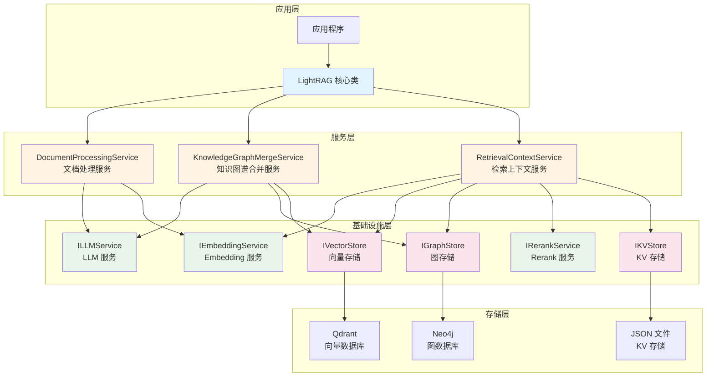
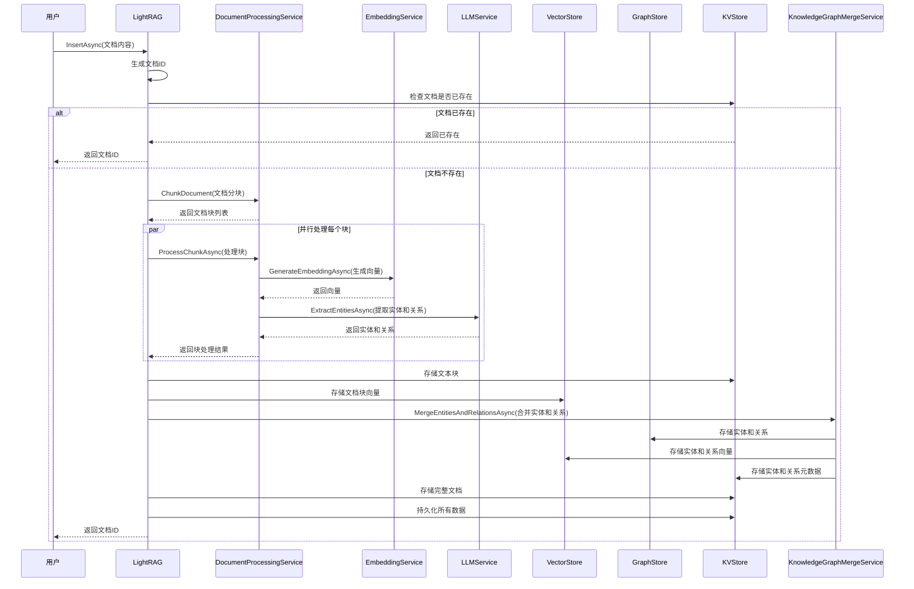
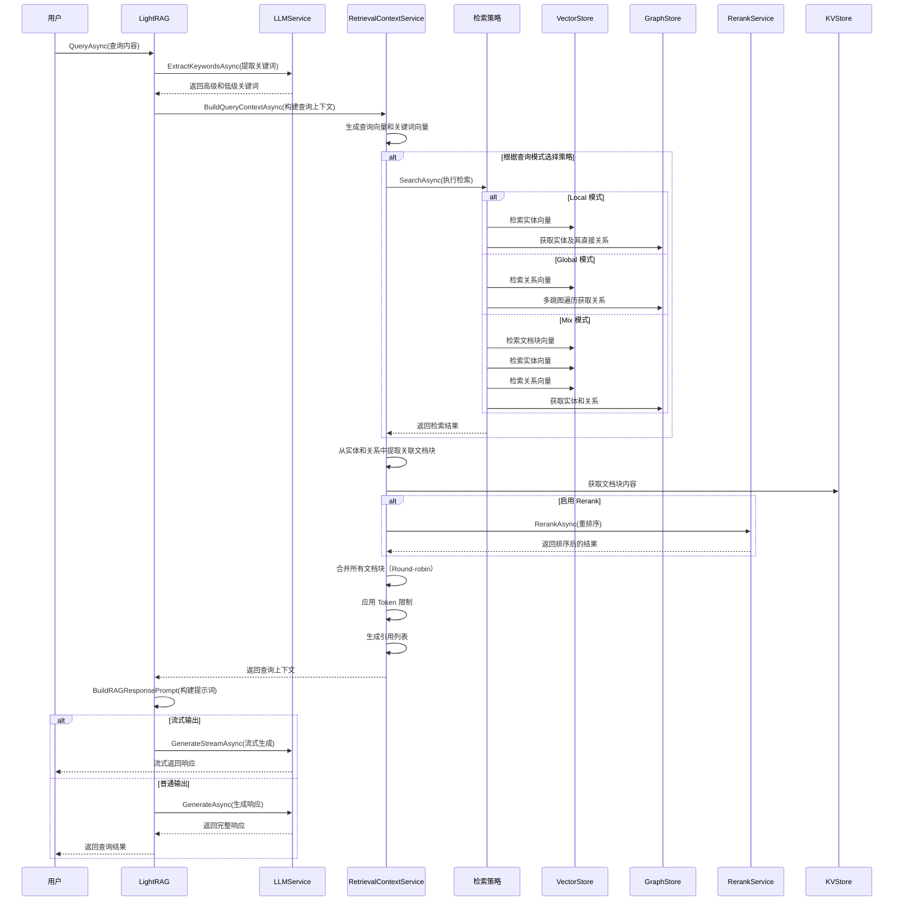
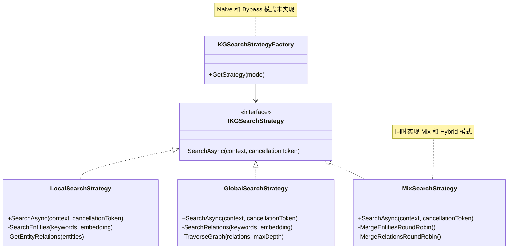

**[EN](LightRAGNet-System-Introduction.md) | [中文](LightRAGNet-System-Introduction.CN.md)**

# LightRAGNet 系统介绍

## 1. 系统概述

### 1.1 系统简介

LightRAGNet 是 LightRAG 的 .NET 实现，完全参考 Python 版本的架构和实现逻辑。LightRAG 是一种基于知识图谱的检索增强生成（RAG）系统，通过结合向量检索和图数据库技术，实现了更精准、更结构化的文档检索和知识问答能力。

LightRAGNet 采用模块化设计，将核心功能拆分为多个独立的服务组件，支持灵活的配置和扩展。系统通过 LLM 自动提取文档中的实体和关系，构建知识图谱，并结合向量检索技术，实现了多层次的文档检索能力。

### 1.2 核心特性

- **知识图谱构建**：自动从文档中提取实体和关系，构建结构化的知识图谱
- **混合检索模式**：支持多种检索模式
  - ✅ **已实现**：Local、Global、Mix、Hybrid（与 Mix 一致）
  - ❌ **未实现**：Naive、Bypass
- **向量检索**：基于 Embedding 的语义相似度检索
- **图数据库存储**：使用 Neo4j 存储知识图谱，支持复杂的图查询
- **向量数据库存储**：使用 Qdrant 存储文档块向量，支持高效的相似度搜索
- **重排序优化**：支持 Rerank 服务对检索结果进行二次排序
- **流式输出**：支持流式生成响应，提升用户体验
- **任务状态追踪**：提供详细的任务执行状态更新，便于监控和调试

### 1.3 系统组件

LightRAGNet 系统由以下核心组件构成：

- **LightRAGNet.Core**：核心接口和模型定义
- **LightRAGNet.LLM**：LLM 服务实现（支持 DeepSeek 等 OpenAI 兼容 API）
- **LightRAGNet.Embedding**：Embedding 服务实现（支持阿里云等）
- **LightRAGNet.Rerank**：Rerank 服务实现（支持阿里云等）
- **LightRAGNet.Storage**：存储实现（Qdrant 向量存储、Neo4j 图存储、JSON 文件 KV 存储）
- **LightRAGNet**：核心 LightRAG 类，协调各个服务
- **LightRAGNet.Hosting**：依赖注入扩展

---

## 2. 系统架构

### 2.1 架构图



### 2.2 架构说明

LightRAGNet 采用分层架构设计，从上到下分为应用层、服务层、基础设施层和存储层：

#### 2.2.1 应用层

- **应用程序**：使用 LightRAGNet 的上层应用
- **LightRAG 核心类**：系统的主入口，协调各个服务组件完成文档索引和查询任务

#### 2.2.2 服务层

- **DocumentProcessingService**：负责文档分块、向量化和实体提取
- **KnowledgeGraphMergeService**：负责合并实体和关系，构建知识图谱
- **RetrievalContextService**：负责构建查询上下文，执行检索策略

#### 2.2.3 基础设施层

- **ILLMService**：大语言模型服务接口，用于文本生成、实体提取、关键词提取等
- **IEmbeddingService**：向量嵌入服务接口，用于生成文本的向量表示
- **IRerankService**：重排序服务接口，用于对检索结果进行二次排序
- **IVectorStore**：向量存储接口，用于存储和检索文档块向量
- **IGraphStore**：图存储接口，用于存储和查询知识图谱
- **IKVStore**：键值存储接口，用于存储文本块、完整文档、实体和关系等元数据

#### 2.2.4 存储层

- **Qdrant**：向量数据库，存储文档块的向量表示
- **Neo4j**：图数据库，存储知识图谱的节点和边
- **JSON 文件**：键值存储，存储文本块、完整文档等结构化数据

### 2.3 基础设施组件

#### 2.3.1 LLM 服务

`ILLMService` 接口定义了以下核心功能：

- `GenerateAsync()`：生成文本响应
- `GenerateStreamAsync()`：流式生成文本响应
- `ExtractEntitiesAsync()`：从文本中提取实体和关系
- `ExtractKeywordsAsync()`：从查询中提取关键词
- `SummarizeAsync()`：生成摘要

当前实现支持 DeepSeek 等 OpenAI 兼容的 API。

#### 2.3.2 Embedding 服务

`IEmbeddingService` 接口提供向量嵌入功能：

- `GenerateEmbeddingAsync()`：为文本生成向量表示

当前实现支持阿里云 Embedding 服务。

#### 2.3.3 Rerank 服务

`IRerankService` 接口提供重排序功能：

- `RerankAsync()`：对检索结果进行重新排序，提升相关性

当前实现支持阿里云 Rerank 服务。

#### 2.3.4 向量存储

`IVectorStore` 接口提供向量存储和检索功能：

- `QueryAsync()`：基于向量相似度检索文档
- `UpsertAsync()`：插入或更新向量文档
- `DeleteAsync()`：删除向量文档
- `GetByIdAsync()`：根据 ID 获取向量文档

当前实现使用 Qdrant 作为向量数据库。

#### 2.3.5 图存储

`IGraphStore` 接口提供图数据库操作功能：

- `UpsertNodeAsync()`：插入或更新节点
- `UpsertEdgeAsync()`：插入或更新边
- `GetKnowledgeGraphAsync()`：获取知识图谱子图
- `GetNodeDegreeAsync()`：获取节点度数
- 批量操作方法：支持批量获取节点、边、度数等

当前实现使用 Neo4j 作为图数据库。

#### 2.3.6 KV 存储

`IKVStore` 接口提供键值存储功能，用于存储：

- **文本块**（TextChunks）：文档分块后的内容
- **完整文档**（FullDocs）：原始文档内容
- **完整实体**（FullEntities）：实体详细信息
- **完整关系**（FullRelations）：关系详细信息
- **实体块**（EntityChunks）：实体关联的文本块 ID
- **关系块**（RelationChunks）：关系关联的文本块 ID

当前实现使用 JSON 文件作为存储后端。

---

## 3. RAG 实现原理

### 3.1 文档索引流程

文档索引是 LightRAGNet 的核心流程之一，系统通过以下步骤处理文档：



#### 3.1.1 文档分块

文档分块采用基于 Token 的滑动窗口策略：

1. **Token 化**：使用 Tokenizer 将文档内容转换为 Token 序列
2. **滑动窗口分割**：按照配置的 `ChunkTokenSize` 和 `ChunkOverlapTokenSize` 进行分割
3. **块标识**：为每个块生成唯一的 ID（基于内容的 MD5 哈希）

关键配置参数：
- `ChunkTokenSize`：每个块的最大 Token 数
- `ChunkOverlapTokenSize`：块之间的重叠 Token 数

#### 3.1.2 块处理

每个文档块需要经过以下处理：

1. **向量化**：使用 Embedding 服务为块内容生成向量表示
2. **实体提取**：使用 LLM 从块内容中提取实体和关系
   - 实体类型包括：Person、Organization、Location、Event、Concept 等
   - 关系包括：实体之间的关联关系，带有权重（weight）信息

#### 3.1.3 知识图谱构建

知识图谱的构建通过 `KnowledgeGraphMergeService` 完成：

1. **实体合并**：将来自不同文档块的相同实体进行合并
   - 合并实体的描述信息
   - 记录实体来源的文档块 ID（SourceId）
   - 存储实体的完整信息到 KV 存储

2. **关系合并**：将来自不同文档块的相同关系进行合并
   - 累加关系的权重（weight），权重越高表示关系出现频率越高
   - 记录关系来源的文档块 ID（RSourceId）
   - 存储关系的完整信息到 KV 存储

3. **图数据库存储**：
   - 将实体存储为图节点（Node）
   - 将关系存储为图边（Edge）
   - 节点和边都包含丰富的属性信息

4. **向量数据库存储**：
   - 为实体生成向量表示并存储
   - 为关系生成向量表示并存储
   - 支持基于向量的相似度检索

### 3.2 查询检索流程

查询检索是 LightRAGNet 的另一个核心流程，系统通过以下步骤处理查询：



#### 3.2.1 关键词提取

查询处理的第一步是提取关键词：

- **高级关键词**（High-level Keywords）：用于关系检索，通常是抽象概念
- **低级关键词**（Low-level Keywords）：用于实体检索，通常是具体实体名称

关键词提取由 LLM 完成，也可以由用户手动指定。

#### 3.2.2 检索策略

系统根据查询模式（QueryMode）选择不同的检索策略：

**已实现的模式**：
- **Local 模式** ✅：聚焦直接相关的实体和关系，适合精确查询
- **Global 模式** ✅：多跳图遍历，发现间接关联，适合探索性查询
- **Mix 模式** ✅：混合知识图谱检索和向量检索，综合多种信息源
- **Hybrid 模式** ✅：与 Mix 模式使用相同的实现，行为一致

**未实现的模式**：
- **Naive 模式** ❌：仅使用向量检索（当前未实现）
- **Bypass 模式** ❌：绕过检索直接生成（当前未实现）

#### 3.2.3 上下文构建

检索完成后，系统需要构建查询上下文：

1. **实体和关系提取**：从检索结果中提取相关的实体和关系
2. **文档块关联**：从实体和关系中提取关联的文档块 ID
3. **文档块获取**：从 KV 存储中获取文档块内容
4. **结果合并**：使用 Round-robin 算法合并来自不同源的文档块
5. **Token 限制**：根据配置的最大 Token 数限制上下文大小
6. **引用生成**：为文档块生成引用 ID，便于后续引用

---

## 4. 文档检索与召回机制

### 4.1 多种检索模式

LightRAGNet 支持多种检索模式，每种模式适用于不同的查询场景。以下是各模式的实现状态：

#### 4.1.1 Local 模式 ✅ 已实现

**特点**：聚焦直接相关的实体和关系

**检索流程**：
1. 使用低级关键词的向量在实体向量库中检索相关实体
2. 从图数据库中获取这些实体的直接关系
3. 从实体和关系中提取关联的文档块

**适用场景**：
- 查询目标明确，需要精确匹配
- 关注实体本身的直接关联
- 需要快速响应

#### 4.1.2 Global 模式 ✅ 已实现

**特点**：多跳图遍历，发现间接关联

**检索流程**：
1. 使用高级关键词的向量在关系向量库中检索相关关系
2. 从图数据库中通过多跳遍历获取相关实体
3. 从关系网络中提取关联的文档块

**适用场景**：
- 需要发现间接关联
- 探索性查询
- 需要更全面的信息覆盖

#### 4.1.3 Mix 模式 ✅ 已实现

**特点**：混合知识图谱检索和向量检索

**检索流程**：
1. 执行知识图谱检索（结合 Local 和 Global）
2. 同时执行文档块向量检索（仅在 Mix 模式下）
3. 使用 Round-robin 算法合并结果

**适用场景**：
- 需要综合多种信息源
- 文档内容检索和结构化检索并重
- 默认推荐模式

#### 4.1.4 Hybrid 模式 ✅ 已实现（与 Mix 模式一致）

**特点**：结合 Local 和 Global 模式

**实现说明**：Hybrid 模式与 Mix 模式使用相同的 `MixSearchStrategy` 实现，两者行为完全一致。

**检索流程**：
1. 同时执行 Local 和 Global 检索
2. 合并两种模式的结果（Round-robin 算法）
3. 去重并排序

**适用场景**：
- 需要平衡精确性和覆盖性
- 复杂查询场景

#### 4.1.5 Naive 模式 ❌ 未实现

仅使用向量检索，不涉及知识图谱。当前版本未实现。

#### 4.1.6 Bypass 模式 ❌ 未实现

绕过检索，直接使用 LLM 生成响应。当前版本未实现。

### 4.2 检索策略实现

系统使用策略模式实现不同的检索策略：



#### 4.2.1 Local 检索策略

`LocalSearchStrategy` 实现局部检索：

1. **实体检索**：使用低级关键词向量在实体向量库中检索 TopK 个实体
2. **关系获取**：从图数据库中获取这些实体的直接关系
3. **结果排序**：按实体度数（rank）和关系权重（weight）排序

#### 4.2.2 Global 检索策略

`GlobalSearchStrategy` 实现全局检索：

1. **关系检索**：使用高级关键词向量在关系向量库中检索 TopK 个关系
2. **图遍历**：从图数据库中通过多跳遍历获取相关实体
3. **结果排序**：按关系权重和实体度数排序

#### 4.2.3 Mix/Hybrid 检索策略 ✅ 已实现（一致）

`MixSearchStrategy` 同时实现 Mix 和 Hybrid 模式，两者行为完全一致：

1. **Local 部分**：使用低级关键词向量检索实体，获取直接关系
2. **Global 部分**：使用高级关键词向量检索关系，进行多跳图遍历
3. **结果合并**：使用 Round-robin 算法合并 Local 和 Global 的结果
4. **向量检索**：在 Mix 模式下，还会执行文档块向量检索（在 `RetrievalContextService` 中处理）

**注意**：Hybrid 和 Mix 模式在代码中使用相同的策略实现，区别在于 Mix 模式会额外执行文档块向量检索。

### 4.3 文档块选择机制

从实体和关系中提取关联文档块时，系统使用加权轮询（Weighted Polling）算法：

#### 4.3.1 加权轮询算法

**算法原理**：
1. 按重要性排序实体/关系（先按 rank，再按 weight）
2. 为每个实体/关系分配期望的文档块数量（线性递减）
3. 第一轮分配：按期望值分配
4. 第二轮分配：多轮扫描分配剩余配额

**算法优势**：
- 重要性高的实体/关系获得更多文档块
- 确保重要信息不被遗漏
- 平衡不同实体/关系的文档块数量

#### 4.3.2 文档块去重

系统在合并文档块时会进行去重：

1. **实体块去重**：统计每个文档块在实体中的出现次数，保留首次出现的块
2. **关系块去重**：排除已在实体块中的文档块，避免重复
3. **Round-robin 合并**：按顺序从向量块、实体块、关系块中交替选择

### 4.4 重排序优化

系统支持使用 Rerank 服务对检索结果进行二次排序：

#### 4.4.1 Rerank 流程

1. **初始检索**：使用向量检索获取 TopK 个候选文档块
2. **Rerank 排序**：使用 Rerank 服务对候选结果重新排序
3. **结果筛选**：选择排序后的 TopK 个文档块

#### 4.4.2 Rerank 优势

- **提升相关性**：基于查询和文档块的语义相关性进行排序
- **减少噪声**：过滤掉相关性较低的文档块
- **优化上下文**：确保最相关的文档块进入上下文

### 4.5 Token 限制机制

系统通过 Token 限制机制控制上下文大小：

#### 4.5.1 分层限制

- **实体 Token 限制**：`MaxEntityTokens`，默认 6000
- **关系 Token 限制**：`MaxRelationTokens`，默认 8000
- **文档块 Token 限制**：`MaxTotalTokens - MaxEntityTokens - MaxRelationTokens`
- **总 Token 限制**：`MaxTotalTokens`，默认 30000

#### 4.5.2 限制策略

1. **实体限制**：按顺序选择实体，直到达到 Token 限制
2. **关系限制**：按顺序选择关系，直到达到 Token 限制
3. **文档块限制**：按顺序选择文档块，直到达到 Token 限制

### 4.6 引用生成机制

系统为检索到的文档块生成引用 ID：

#### 4.6.1 引用生成流程

1. **统计频率**：统计每个文件路径（file_path）在文档块中的出现次数
2. **排序**：按频率降序、首次出现位置升序排序文件路径
3. **分配 ID**：为每个唯一的文件路径分配连续的引用 ID（1, 2, 3...）
4. **关联文档块**：为每个文档块添加对应的引用 ID

#### 4.6.2 引用列表格式

引用列表格式如下：

```
Reference Document List:
[1] document1.txt
[2] document2.txt
[3] document3.txt
```

文档块中包含 `reference_id` 字段，指向对应的引用文档。

---

## 5. 系统设计分析

### 5.1 系统优势

#### 5.1.1 结构化知识表示

LightRAGNet 通过知识图谱实现了结构化的知识表示：

- **实体提取**：自动从文档中提取实体，包括人物、组织、地点、事件等
- **关系建模**：建立实体之间的关系，形成知识网络
- **权重机制**：关系权重反映出现频率，重要性高的关系权重更高

这种结构化表示使得系统能够：
- 理解实体之间的关联关系
- 支持复杂的图查询和多跳遍历
- 提供更精准的语义检索

#### 5.1.2 多模式检索能力

系统支持多种检索模式，适应不同的查询场景：

**已实现的模式**：
- **Local 模式** ✅：快速精确检索，适合明确查询
- **Global 模式** ✅：深度探索，发现间接关联
- **Mix 模式** ✅：综合多种信息源，平衡精确性和覆盖性
- **Hybrid 模式** ✅：与 Mix 模式一致，结合 Local 和 Global

**未实现的模式**：
- **Naive 模式** ❌：仅使用向量检索（当前未实现）
- **Bypass 模式** ❌：绕过检索直接生成（当前未实现）

这种灵活性使得系统能够：
- 根据查询类型选择最合适的检索策略
- 提供更全面的信息覆盖
- 适应不同用户的需求

#### 5.1.3 混合检索架构

系统结合了向量检索和图检索的优势：

- **向量检索**：基于语义相似度，适合语义匹配
- **图检索**：基于结构化关系，适合关系查询
- **混合检索**：综合两种方式，提供更全面的检索能力

这种混合架构使得系统能够：
- 同时利用语义信息和结构化信息
- 提供更精准的检索结果
- 适应不同类型的查询需求

#### 5.1.4 可扩展的架构设计

系统采用接口抽象和依赖注入设计：

- **接口抽象**：所有核心功能都通过接口定义，便于替换实现
- **模块化设计**：各组件独立，便于维护和扩展
- **依赖注入**：通过 DI 容器管理依赖，便于测试和配置

这种设计使得系统能够：
- 轻松替换底层实现（如更换向量数据库、图数据库）
- 支持多种 LLM、Embedding、Rerank 服务
- 便于功能扩展和定制

#### 5.1.5 完善的元数据管理

系统通过 KV 存储管理丰富的元数据：

- **文本块存储**：存储文档块内容、Token 数、顺序等信息
- **完整文档存储**：存储原始文档内容和块列表
- **实体和关系存储**：存储实体和关系的完整信息
- **关联关系存储**：存储实体/关系与文档块的关联

这种元数据管理使得系统能够：
- 快速定位和获取相关文档块
- 追踪实体和关系的来源
- 支持复杂的查询和分析

#### 5.1.6 任务状态追踪

系统提供详细的任务执行状态更新：

- **阶段划分**：文档分块、块处理、存储、持久化等不同阶段
- **进度追踪**：实时更新当前进度和总进度
- **状态事件**：通过事件机制通知上层应用

这种状态追踪使得系统能够：
- 提供良好的用户体验
- 便于监控和调试
- 支持长时间运行的任务

### 5.2 系统劣势

#### 5.2.1 计算资源消耗

系统需要大量的计算资源：

- **LLM 调用**：每个文档块都需要调用 LLM 进行实体提取，成本较高
- **向量生成**：需要为每个文档块、实体、关系生成向量，计算量大
- **图数据库查询**：复杂的图查询可能消耗较多资源

**影响**：
- 处理大量文档时成本较高
- 需要较长的处理时间
- 对硬件资源要求较高

#### 5.2.2 存储空间需求

系统需要存储多种类型的数据：

- **向量数据**：文档块、实体、关系的向量表示，占用空间较大
- **图数据**：知识图谱的节点和边，随着文档增加而增长
- **元数据**：文本块、完整文档等元数据，占用额外空间

**影响**：
- 需要较大的存储空间
- 存储成本可能较高
- 数据迁移和备份较复杂

#### 5.2.3 依赖外部服务

系统依赖多个外部服务：

- **LLM 服务**：需要稳定的 LLM API 服务
- **Embedding 服务**：需要稳定的 Embedding API 服务
- **Rerank 服务**：需要稳定的 Rerank API 服务
- **数据库服务**：需要维护 Qdrant 和 Neo4j 服务

**影响**：
- 服务可用性依赖外部服务
- 网络延迟可能影响性能
- API 调用成本可能较高

#### 5.2.4 知识图谱质量依赖 LLM

知识图谱的质量完全依赖 LLM 的实体提取能力：

- **提取准确性**：LLM 可能提取错误的实体或关系
- **一致性**：不同文档块中可能对同一实体有不同的表示
- **完整性**：可能遗漏重要的实体或关系

**影响**：
- 知识图谱质量不稳定
- 需要人工审核和修正
- 可能影响检索准确性

#### 5.2.5 配置复杂度

系统需要配置多个组件：

- **LLM 配置**：API 地址、密钥、模型名称等
- **Embedding 配置**：API 地址、密钥、模型名称等
- **数据库配置**：Qdrant、Neo4j 的连接信息
- **参数调优**：Token 大小、TopK 数量、权重参数等

**影响**：
- 配置较复杂，需要一定的技术背景
- 参数调优需要经验和实验
- 维护成本较高

### 5.3 适用场景

#### 5.3.1 企业知识库问答

**场景描述**：
- 企业内部有大量文档（技术文档、产品文档、政策文档等）
- 员工需要快速查找相关信息
- 需要理解文档之间的关联关系

**系统优势**：
- 知识图谱能够建模文档之间的关联
- 多模式检索适应不同类型的查询
- 引用机制便于追溯信息来源

#### 5.3.2 学术文献检索

**场景描述**：
- 研究人员需要检索相关学术文献
- 需要理解文献之间的引用关系
- 需要发现间接相关的文献

**系统优势**：
- Global 模式支持多跳遍历，发现间接关联
- 知识图谱能够建模文献之间的引用关系
- 混合检索提供更全面的检索结果

#### 5.3.3 法律文档分析

**场景描述**：
- 律师需要检索相关法律条文和案例
- 需要理解法律概念之间的关系
- 需要追溯法律条文的来源

**系统优势**：
- 知识图谱能够建模法律概念之间的关系
- 引用机制便于追溯法律条文来源
- 结构化检索支持精确查询

#### 5.3.4 医疗知识问答

**场景描述**：
- 医生需要检索相关医疗知识和病例
- 需要理解疾病、症状、药物之间的关系
- 需要综合多种信息源

**系统优势**：
- 知识图谱能够建模医疗知识的结构化关系
- Mix 模式综合多种信息源
- 支持复杂的医疗知识查询

#### 5.3.5 产品文档智能问答

**场景描述**：
- 用户需要查询产品使用文档
- 需要理解功能之间的关联
- 需要快速定位相关信息

**系统优势**：
- Local 模式支持快速精确检索
- 知识图谱能够建模产品功能之间的关系
- 引用机制便于用户查看详细文档

#### 5.3.6 不适用场景

以下场景可能不适合使用 LightRAGNet：

- **简单文档检索**：如果只需要简单的关键词匹配，不需要复杂的知识图谱
- **实时性要求极高**：系统需要较长的索引时间，不适合实时性要求极高的场景
- **资源受限环境**：系统需要较多的计算和存储资源，不适合资源受限的环境
- **文档量很小**：如果文档量很小，知识图谱的优势不明显，反而增加复杂度

---

## 6. 总结

LightRAGNet 是一个功能强大的 RAG 系统，通过结合知识图谱和向量检索技术，实现了结构化的知识表示和多模式的检索能力。系统采用模块化设计，具有良好的可扩展性，适用于企业知识库、学术文献检索、法律文档分析等多种场景。

然而，系统也存在计算资源消耗大、存储空间需求高、依赖外部服务等劣势，需要根据实际场景权衡使用。在选择使用 LightRAGNet 时，需要充分考虑系统的优势和劣势，确保能够满足实际需求。
