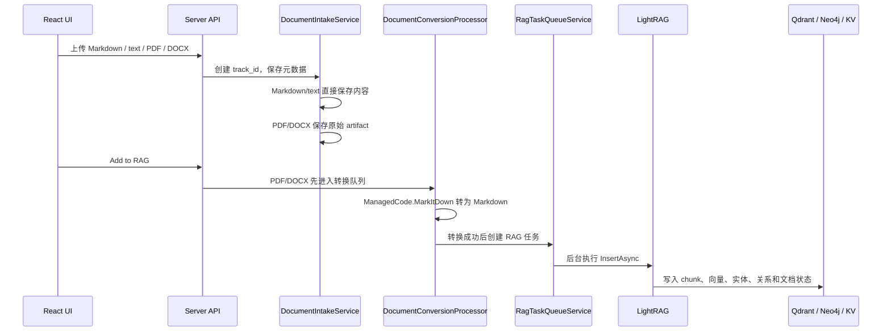
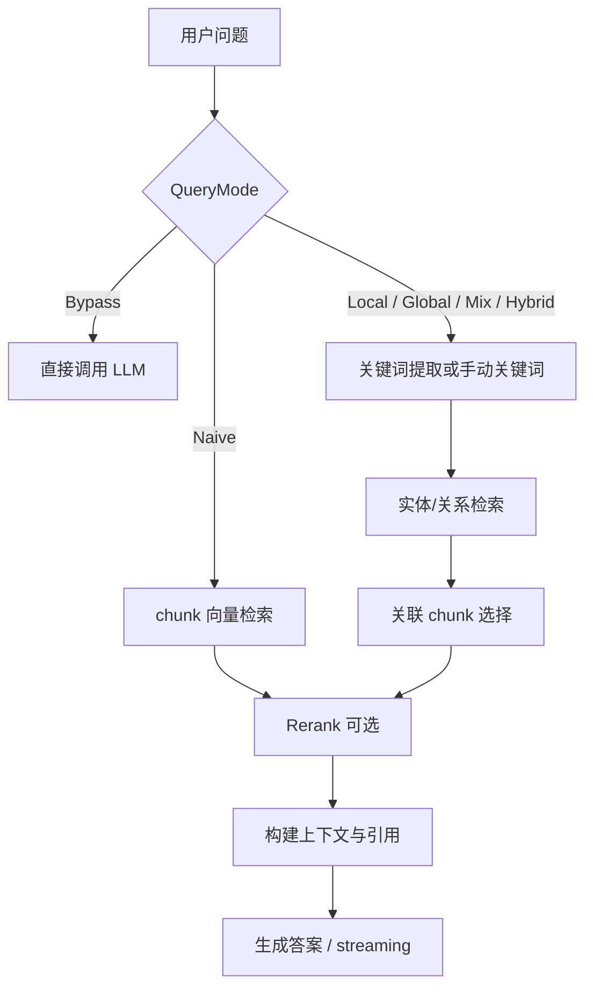

  <a href="./LightRAGNet-System-Introduction.CN.md">中文</a> | <a href="./LightRAGNet-System-Introduction.md">English</a>

# LightRAGNet 系统介绍

这篇文档按当前项目状态重写，不再复述早期方案。现在的 LightRAGNet 已经不是单纯的 LightRAG 核心类 Demo，而是一个带 Server、React UI、文档接入、后台任务、RAG Chat、知识图谱工作台和测试边界的 .NET 10 工程。

## 1. 项目定位

LightRAGNet 的目标很明确：把 Python LightRAG 的核心思想搬到 .NET 生态里，并且做成一个能继续开发、能验证、能跑 React UI 的工程底座。

它当前主要解决几件事：

- 文档从上传到入库要有状态，不要一上传就黑盒处理。
- RAG 查询不只返回答案，还要能看引用、检索数据和调试信息。
- 检索不只靠 chunk vector，也要用知识图谱里的实体、关系和来源块。
- 图谱不是只存在 Neo4j 里，React 前端也要能看、能搜索、能继续做治理。
- 测试必须保护本机 Qdrant / Neo4j 开发数据，不能一次 `dotnet test` 把本地数据清了。

## 2. 当前能力快照

| 模块 | 当前情况 |
| --- | --- |
| 文档接入 | 支持 Markdown、text、PDF、DOCX；PDF/DOCX 会保存原始 artifact，再转换为 `converted.md`。 |
| 文档生命周期 | 使用 `track_id` 贯穿批量上传、转换、入队、取消、重试和状态刷新。 |
| 索引流程 | 文档分块、chunk embedding、实体/关系抽取、KG 合并、Qdrant/Neo4j/KV 写入。 |
| 查询模式 | `Local`、`Global`、`Mix`、`Hybrid`、`Naive`、`Bypass` 都已有实现路径。 |
| Rerank | 支持长 chunk 子片段 rerank，再按原始 chunk 聚合分数。 |
| 缓存 | 索引阶段和查询阶段都有 LLM cache；查询 cache 受 workspace revision 约束。 |
| React UI | React/Vite 承载 RAG Chat、文档管理、上传入口、文档预览、系统状态、缓存管理和图谱工作台。 |
| 图谱工作台 | React/Vite + Sigma，支持图谱浏览、搜索、布局、缩放、设置、全屏和图谱治理语义。 |
| 测试 | 核心、Server、Web 都有测试；Server 测试默认替换真实外部存储。 |

## 3. 系统结构

  

这张图不是按“技术名词堆叠”画的，而是按当前代码里真实存在的边界画：React UI、Server API、LightRAG Core、Providers & Stores。读图时先看三条线：

- 文档入库线：上传入口进入 `DocumentIntakeService`，PDF/DOCX 经过 `DocumentConversionProcessor`，随后由 `RagTaskQueueService` 和 `RagTaskProcessorService` 调用 `LightRAG` 入库。
- 查询回答线：RAG Chat 经过 Server API 进入 `LightRAG`，由 `RetrievalContextService` 组织 KG、vector、rerank 和引用数据，再交给 LLM 生成回答。
- 图谱治理线：React 图谱工作台通过 Server API 调用 `GraphCurationService`，修改 Neo4j 图谱、Qdrant 向量索引和相关 tracking 数据。

`TaskStatusHub` 是状态回传通道，SQLite 是文档元数据和 pipeline 状态库；Qdrant、Neo4j、JSON KV 和文件 artifact 才是 RAG 数据的主体存储。

项目分层不是为了好看，是为了后面能换 provider、能测、能继续拆功能：

- `LightRAGNet.Core`：接口、模型、工具类。
- `LightRAGNet.Share`：React UI 客户端与 Server 共用的 DTO、事件和请求/响应模型。
- `LightRAGNet`：核心编排层，包含索引、查询、删除、缓存、文档生命周期和图谱治理服务。
- `LightRAGNet.Hosting`：DI 注册入口，把核心服务、provider 和后台服务组起来。
- `LightRAGNet.Server`：API、SignalR、SQLite 元数据、文档 artifact、转换处理器和外部存储清理边界。
- `LightRAGNet.React`：React/Vite 前端，包含 RAG Chat、Documents、Document Preview、Graph Workbench、System Status 与 Cache Management。
- `LightRAGNet.Storage`、`LLM`、`Embedding`、`Rerank`：具体 provider 实现。

## 4. 真实界面状态

  

图谱工作台是当前项目最直观的界面成果。它已经不是“以后会做”的部分，而是 React UI 里的真实页面：可以取子图、搜索节点、调整布局、缩放定位，并用 Sigma 画布展示实体和关系。

这部分的目标不是替代 Neo4j Browser。Neo4j Browser 偏数据库视角，LightRAGNet 的图谱工作台更偏 RAG 用户视角：看文档入库后生成了什么图谱，理解查询命中的结构，后续再做实体合并、关系编辑和属性治理。

## 5. 文档入库链路

当前文档入库不是一条简单的 `upload -> InsertAsync`：

```mermaid
sequenceDiagram
    participant UI as React UI
    participant API as Server API
    participant Intake as DocumentIntakeService
    participant Conv as DocumentConversionProcessor
    participant Queue as RagTaskQueueService
    participant Rag as LightRAG
    participant Store as Qdrant / Neo4j / KV

    UI->>API: 上传 Markdown / text / PDF / DOCX
    API->>Intake: 创建 track_id，保存元数据
    Intake->>Intake: Markdown/text 直接保存内容
    Intake->>Intake: PDF/DOCX 保存原始 artifact
    UI->>API: Add to RAG
    API->>Conv: PDF/DOCX 先进入转换队列
    Conv->>Conv: ManagedCode.MarkItDown 转为 Markdown
    Conv->>Queue: 转换成功后创建 RAG 任务
    Queue->>Rag: 后台执行 InsertAsync
    Rag->>Store: 写入 chunk、向量、实体、关系和文档状态
```

这条链路的好处是：上传、转换、入库、失败、取消和重试都能被看见。坏处也很明显：状态更多，边界也更多，所以测试必须覆盖竞态和取消路径。

## 6. 查询链路

查询入口主要来自 RAG Chat，也可以直接使用 `LightRAG.QueryAsync`。现在的查询流程大致是：

```mermaid
flowchart TD
    Query[用户问题] --> Mode{QueryMode}
    Mode -->|Bypass| LLM[直接调用 LLM]
    Mode -->|Naive| ChunkVector[chunk 向量检索]
    Mode -->|Local / Global / Mix / Hybrid| Keywords[关键词提取或手动关键词]
    Keywords --> KG[实体/关系检索]
    KG --> Chunks[关联 chunk 选择]
    ChunkVector --> Rerank[Rerank 可选]
    Chunks --> Rerank
    Rerank --> Context[构建上下文与引用]
    Context --> Answer[生成答案 / streaming]
```

几个关键点：

- `Bypass` 不走检索，适合直接测试模型响应。
- `Naive` 只走 chunk vector，不使用知识图谱。
- `Local` 更偏实体和直接关系。
- `Global` 更偏关系和多跳图结构。
- `Mix` 会把 KG 与 chunk vector 合起来，是当前更常用的默认模式。
- `Hybrid` 保留为兼容模式，语义上接近 Mix。

回答除了正文，还可以返回 references、diagnostics、raw retrieval data。这个设计是为了让调试不是靠猜：一次回答为什么这么答，至少能看到它检索了什么。

## 7. 存储边界

LightRAGNet 当前同时使用几类存储：

- SQLite：Server 的文档元数据、上传状态、转换状态、RAG 状态。
- JSON KV：LightRAG workspace 内的 full_docs、text_chunks、entities、relations、cache 等。
- Qdrant：chunk、entity、relationship 的向量集合。
- Neo4j：实体节点和关系边。
- 文件系统 artifact：PDF/DOCX 原始文件和转换后的 Markdown。

这些存储不是一个事务系统。代码里做的是工程上的一致性：状态记录、任务恢复、删除计划、可重试路径、测试隔离。后续如果要做生产级部署，还需要进一步补初始化检查、健康检查、备份和权限策略。

## 8. 删除和图谱治理

项目现在已经不只考虑“加文档”，也开始处理“删文档”和“改图谱”：

- indexed document deletion 会清理文档状态、chunk、向量、图谱来源引用和可选 LLM cache。
- clear-all 这类危险操作在测试中必须隔离，不能碰本机真实开发库。
- 图谱治理服务已经覆盖实体重命名、合并、删除、关系删除等方向，并处理相关 vector 与 tracking 数据。

这里的核心原则是：RAG 系统不是只进不出。文档会删，实体会合并，关系会修正，所以索引结果必须能被治理。

## 9. 当前限制

说清楚边界更重要：

- 这仍是开发阶段项目，不是开箱即用的生产部署模板。
- 默认 provider 偏向 DeepSeek、DashScope、Qdrant、Neo4j。
- 图谱工作台已经能展示和操作一部分语义，但完整图谱治理体验还在继续补。
- 多存储一致性是工程补偿式的，不是分布式事务。
- Docker Compose、密钥、Neo4j 密码、volume 路径都需要按真实环境调整。

## 10. 相关文档

- [README.md](./README.md)
- [RAG 任务队列处理方案](./RAG-Task-Queue-Processing-Solution.CN.md)
- [English version](./LightRAGNet-System-Introduction.md)
