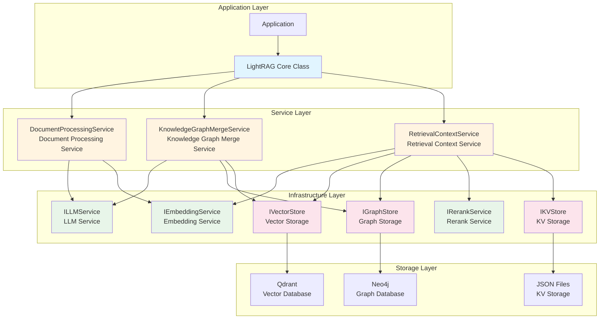
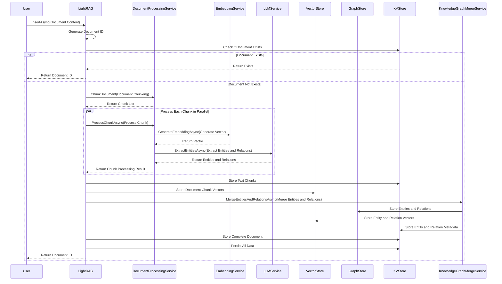
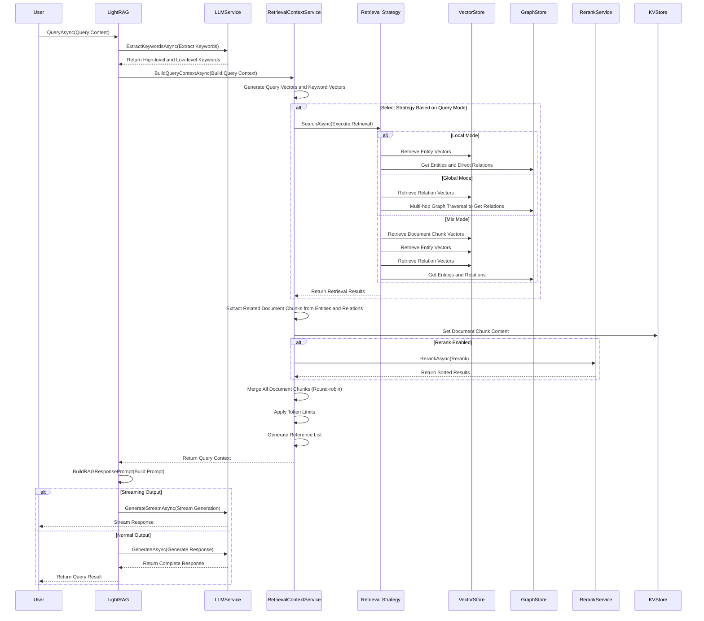
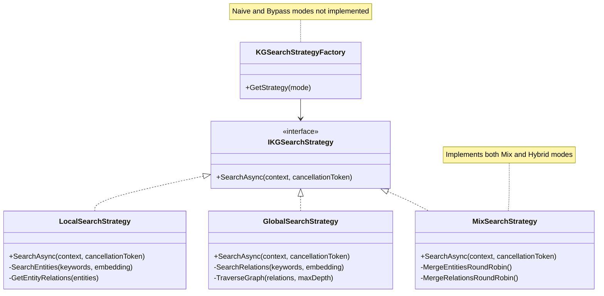

**[EN](LightRAGNet-System-Introduction.md) | [中文](LightRAGNet-System-Introduction.CN.md)**

# LightRAGNet System Introduction

## 1. System Overview

### 1.1 System Introduction

LightRAGNet is a .NET implementation of LightRAG, fully referencing the architecture and implementation logic of the Python version. LightRAG is a knowledge graph-based Retrieval-Augmented Generation (RAG) system that combines vector retrieval and graph database technologies to achieve more precise and structured document retrieval and knowledge Q&A capabilities.

LightRAGNet adopts a modular design, splitting core functionality into multiple independent service components, supporting flexible configuration and extension. The system automatically extracts entities and relationships from documents through LLM, builds knowledge graphs, and combines vector retrieval technology to achieve multi-level document retrieval capabilities.

### 1.2 Core Features

- **Knowledge Graph Construction**: Automatically extracts entities and relationships from documents to build structured knowledge graphs
- **Hybrid Retrieval Modes**: Supports multiple retrieval modes
  - ✅ **Implemented**: Local, Global, Mix, Hybrid (consistent with Mix)
  - ❌ **Not Implemented**: Naive, Bypass
- **Vector Retrieval**: Semantic similarity retrieval based on Embedding
- **Graph Database Storage**: Uses Neo4j to store knowledge graphs, supporting complex graph queries
- **Vector Database Storage**: Uses Qdrant to store document chunk vectors, supporting efficient similarity search
- **Rerank Optimization**: Supports Rerank service for secondary sorting of retrieval results
- **Streaming Output**: Supports streaming response generation for better user experience
- **Task State Tracking**: Provides detailed task execution state updates for monitoring and debugging

### 1.3 System Components

LightRAGNet system consists of the following core components:

- **LightRAGNet.Core**: Core interfaces and model definitions
- **LightRAGNet.LLM**: LLM service implementation (supports DeepSeek and other OpenAI-compatible APIs)
- **LightRAGNet.Embedding**: Embedding service implementation (supports Alibaba Cloud, etc.)
- **LightRAGNet.Rerank**: Rerank service implementation (supports Alibaba Cloud, etc.)
- **LightRAGNet.Storage**: Storage implementations (Qdrant vector storage, Neo4j graph storage, JSON file KV storage)
- **LightRAGNet**: Core LightRAG class, coordinating various services
- **LightRAGNet.Hosting**: Dependency injection extensions

---

## 2. System Architecture

### 2.1 Architecture Diagram



### 2.2 Architecture Overview

LightRAGNet adopts a layered architecture design, divided from top to bottom into application layer, service layer, infrastructure layer, and storage layer:

#### 2.2.1 Application Layer

- **Application**: Upper-level applications using LightRAGNet
- **LightRAG Core Class**: Main entry point of the system, coordinating various service components to complete document indexing and query tasks

#### 2.2.2 Service Layer

- **DocumentProcessingService**: Responsible for document chunking, vectorization, and entity extraction
- **KnowledgeGraphMergeService**: Responsible for merging entities and relationships, building knowledge graphs
- **RetrievalContextService**: Responsible for building query context and executing retrieval strategies

#### 2.2.3 Infrastructure Layer

- **ILLMService**: Large language model service interface for text generation, entity extraction, keyword extraction, etc.
- **IEmbeddingService**: Vector embedding service interface for generating vector representations of text
- **IRerankService**: Rerank service interface for secondary sorting of retrieval results
- **IVectorStore**: Vector storage interface for storing and retrieving document chunk vectors
- **IGraphStore**: Graph storage interface for storing and querying knowledge graphs
- **IKVStore**: Key-value storage interface for storing text chunks, complete documents, entities, relationships, and other metadata

#### 2.2.4 Storage Layer

- **Qdrant**: Vector database, storing vector representations of document chunks
- **Neo4j**: Graph database, storing nodes and edges of knowledge graphs
- **JSON Files**: Key-value storage, storing text chunks, complete documents, and other structured data

### 2.3 Infrastructure Components

#### 2.3.1 LLM Service

The `ILLMService` interface defines the following core functions:

- `GenerateAsync()`: Generate text responses
- `GenerateStreamAsync()`: Stream text responses
- `ExtractEntitiesAsync()`: Extract entities and relationships from text
- `ExtractKeywordsAsync()`: Extract keywords from queries
- `SummarizeAsync()`: Generate summaries

Current implementation supports DeepSeek and other OpenAI-compatible APIs.

#### 2.3.2 Embedding Service

The `IEmbeddingService` interface provides vector embedding functionality:

- `GenerateEmbeddingAsync()`: Generate vector representations for text

Current implementation supports Alibaba Cloud Embedding service.

#### 2.3.3 Rerank Service

The `IRerankService` interface provides reranking functionality:

- `RerankAsync()`: Re-sort retrieval results to improve relevance

Current implementation supports Alibaba Cloud Rerank service.

#### 2.3.4 Vector Storage

The `IVectorStore` interface provides vector storage and retrieval functionality:

- `QueryAsync()`: Retrieve documents based on vector similarity
- `UpsertAsync()`: Insert or update vector documents
- `DeleteAsync()`: Delete vector documents
- `GetByIdAsync()`: Get vector documents by ID

Current implementation uses Qdrant as the vector database.

#### 2.3.5 Graph Storage

The `IGraphStore` interface provides graph database operations:

- `UpsertNodeAsync()`: Insert or update nodes
- `UpsertEdgeAsync()`: Insert or update edges
- `GetKnowledgeGraphAsync()`: Get knowledge graph subgraphs
- `GetNodeDegreeAsync()`: Get node degrees
- Batch operation methods: Support batch retrieval of nodes, edges, degrees, etc.

Current implementation uses Neo4j as the graph database.

#### 2.3.6 KV Storage

The `IKVStore` interface provides key-value storage functionality for storing:

- **Text Chunks** (TextChunks): Content after document chunking
- **Full Documents** (FullDocs): Original document content
- **Full Entities** (FullEntities): Detailed entity information
- **Full Relations** (FullRelations): Detailed relationship information
- **Entity Chunks** (EntityChunks): Text chunk IDs associated with entities
- **Relation Chunks** (RelationChunks): Text chunk IDs associated with relationships

Current implementation uses JSON files as the storage backend.

---

## 3. RAG Implementation Principles

### 3.1 Document Indexing Flow

Document indexing is one of the core processes of LightRAGNet. The system processes documents through the following steps:



#### 3.1.1 Document Chunking

Document chunking uses a Token-based sliding window strategy:

1. **Tokenization**: Use Tokenizer to convert document content into Token sequences
2. **Sliding Window Segmentation**: Split according to configured `ChunkTokenSize` and `ChunkOverlapTokenSize`
3. **Chunk Identification**: Generate unique ID for each chunk (based on MD5 hash of content)

Key configuration parameters:
- `ChunkTokenSize`: Maximum number of Tokens per chunk
- `ChunkOverlapTokenSize`: Overlapping Token count between chunks

#### 3.1.2 Chunk Processing

Each document chunk needs to go through the following processing:

1. **Vectorization**: Use Embedding service to generate vector representations for chunk content
2. **Entity Extraction**: Use LLM to extract entities and relationships from chunk content
   - Entity types include: Person, Organization, Location, Event, Concept, etc.
   - Relationships include: Associations between entities with weight information

#### 3.1.3 Knowledge Graph Construction

Knowledge graph construction is completed through `KnowledgeGraphMergeService`:

1. **Entity Merging**: Merge the same entities from different document chunks
   - Merge entity description information
   - Record document chunk IDs (SourceId) from which entities originate
   - Store complete entity information to KV storage

2. **Relationship Merging**: Merge the same relationships from different document chunks
   - Accumulate relationship weights (weight), higher weights indicate higher frequency
   - Record document chunk IDs (RSourceId) from which relationships originate
   - Store complete relationship information to KV storage

3. **Graph Database Storage**:
   - Store entities as graph nodes (Node)
   - Store relationships as graph edges (Edge)
   - Both nodes and edges contain rich attribute information

4. **Vector Database Storage**:
   - Generate and store vector representations for entities
   - Generate and store vector representations for relationships
   - Support vector-based similarity retrieval

### 3.2 Query Retrieval Flow

Query retrieval is another core process of LightRAGNet. The system processes queries through the following steps:



#### 3.2.1 Keyword Extraction

The first step in query processing is keyword extraction:

- **High-level Keywords**: Used for relation retrieval, usually abstract concepts
- **Low-level Keywords**: Used for entity retrieval, usually specific entity names

Keyword extraction is completed by LLM, or can be manually specified by users.

#### 3.2.2 Retrieval Strategy

The system selects different retrieval strategies based on query mode (QueryMode):

**Implemented Modes**:
- **Local Mode** ✅: Focuses on directly related entities and relationships, suitable for precise queries
- **Global Mode** ✅: Multi-hop graph traversal to discover indirect associations, suitable for exploratory queries
- **Mix Mode** ✅: Combines knowledge graph retrieval and vector retrieval, integrating multiple information sources
- **Hybrid Mode** ✅: Uses the same implementation as Mix mode, with consistent behavior

**Not Implemented Modes**:
- **Naive Mode** ❌: Vector retrieval only (currently not implemented)
- **Bypass Mode** ❌: Bypasses retrieval and generates directly (currently not implemented)

#### 3.2.3 Context Construction

After retrieval is complete, the system needs to build query context:

1. **Entity and Relation Extraction**: Extract relevant entities and relationships from retrieval results
2. **Document Chunk Association**: Extract associated document chunk IDs from entities and relationships
3. **Document Chunk Retrieval**: Get document chunk content from KV storage
4. **Result Merging**: Use Round-robin algorithm to merge document chunks from different sources
5. **Token Limits**: Limit context size based on configured maximum Token count
6. **Reference Generation**: Generate reference IDs for document chunks for subsequent referencing

---

## 4. Document Retrieval and Recall Mechanisms

### 4.1 Multiple Retrieval Modes

LightRAGNet supports multiple retrieval modes, each suitable for different query scenarios. The following is the implementation status of each mode:

#### 4.1.1 Local Mode ✅ Implemented

**Characteristics**: Focuses on directly related entities and relationships

**Retrieval Flow**:
1. Use low-level keyword vectors to retrieve related entities from entity vector database
2. Get direct relationships of these entities from graph database
3. Extract associated document chunks from entities and relationships

**Use Cases**:
- Clear query objectives, need precise matching
- Focus on direct associations of entities themselves
- Need fast response

#### 4.1.2 Global Mode ✅ Implemented

**Characteristics**: Multi-hop graph traversal to discover indirect associations

**Retrieval Flow**:
1. Use high-level keyword vectors to retrieve related relationships from relation vector database
2. Get related entities through multi-hop traversal from graph database
3. Extract associated document chunks from relationship networks

**Use Cases**:
- Need to discover indirect associations
- Exploratory queries
- Need more comprehensive information coverage

#### 4.1.3 Mix Mode ✅ Implemented

**Characteristics**: Combines knowledge graph retrieval and vector retrieval

**Retrieval Flow**:
1. Execute knowledge graph retrieval (combining Local and Global)
2. Simultaneously execute document chunk vector retrieval (only in Mix mode)
3. Merge results using Round-robin algorithm

**Use Cases**:
- Need to integrate multiple information sources
- Both document content retrieval and structured retrieval are important
- Default recommended mode

#### 4.1.4 Hybrid Mode ✅ Implemented (Consistent with Mix Mode)

**Characteristics**: Combines Local and Global modes

**Implementation Note**: Hybrid mode uses the same `MixSearchStrategy` implementation as Mix mode, with completely consistent behavior.

**Retrieval Flow**:
1. Execute both Local and Global retrieval simultaneously
2. Merge results from both modes (Round-robin algorithm)
3. Deduplicate and sort

**Use Cases**:
- Need to balance precision and coverage
- Complex query scenarios

#### 4.1.5 Naive Mode ❌ Not Implemented

Vector retrieval only, does not involve knowledge graphs. Not implemented in current version.

#### 4.1.6 Bypass Mode ❌ Not Implemented

Bypasses retrieval and directly uses LLM to generate responses. Not implemented in current version.

### 4.2 Retrieval Strategy Implementation

The system uses the strategy pattern to implement different retrieval strategies:



#### 4.2.1 Local Retrieval Strategy

`LocalSearchStrategy` implements local retrieval:

1. **Entity Retrieval**: Use low-level keyword vectors to retrieve TopK entities from entity vector database
2. **Relation Retrieval**: Get direct relationships of these entities from graph database
3. **Result Sorting**: Sort by entity degree (rank) and relationship weight

#### 4.2.2 Global Retrieval Strategy

`GlobalSearchStrategy` implements global retrieval:

1. **Relation Retrieval**: Use high-level keyword vectors to retrieve TopK relations from relation vector database
2. **Graph Traversal**: Get related entities through multi-hop traversal from graph database
3. **Result Sorting**: Sort by relation weight and entity degree

#### 4.2.3 Mix/Hybrid Retrieval Strategy ✅ Implemented (Consistent)

`MixSearchStrategy` implements both Mix and Hybrid modes simultaneously, with completely consistent behavior:

1. **Local Part**: Use low-level keyword vectors to retrieve entities, get direct relationships
2. **Global Part**: Use high-level keyword vectors to retrieve relations, perform multi-hop graph traversal
3. **Result Merging**: Use Round-robin algorithm to merge Local and Global results
4. **Vector Retrieval**: In Mix mode, also executes document chunk vector retrieval (handled in `RetrievalContextService`)

**Note**: Hybrid and Mix modes use the same strategy implementation in code, the difference is that Mix mode additionally executes document chunk vector retrieval.

### 4.3 Document Chunk Selection Mechanism

When extracting associated document chunks from entities and relationships, the system uses a Weighted Polling algorithm:

#### 4.3.1 Weighted Polling Algorithm

**Algorithm Principle**:
1. Sort entities/relationships by importance (first by rank, then by weight)
2. Allocate expected document chunk count for each entity/relationship (linear decrease)
3. First Round Allocation: Allocate according to expected values
4. Second Round Allocation: Multi-round scanning to allocate remaining quota

**Algorithm Advantages**:
- Entities/relationships with higher importance get more document chunks
- Ensures important information is not missed
- Balances document chunk counts across different entities/relationships

#### 4.3.2 Document Chunk Deduplication

The system performs deduplication when merging document chunks:

1. **Entity Chunk Deduplication**: Count occurrences of each document chunk in entities, keep first occurrence
2. **Relation Chunk Deduplication**: Exclude document chunks already in entity chunks to avoid duplication
3. **Round-robin Merging**: Alternately select from vector chunks, entity chunks, and relation chunks in order

### 4.4 Rerank Optimization

The system supports using Rerank service for secondary sorting of retrieval results:

#### 4.4.1 Rerank Flow

1. **Initial Retrieval**: Use vector retrieval to get TopK candidate document chunks
2. **Rerank Sorting**: Use Rerank service to re-sort candidate results
3. **Result Filtering**: Select TopK document chunks after sorting

#### 4.4.2 Rerank Advantages

- **Improve Relevance**: Sort based on semantic relevance between queries and document chunks
- **Reduce Noise**: Filter out document chunks with lower relevance
- **Optimize Context**: Ensure the most relevant document chunks enter the context

### 4.5 Token Limit Mechanism

The system controls context size through Token limit mechanism:

#### 4.5.1 Layered Limits

- **Entity Token Limit**: `MaxEntityTokens`, default 6000
- **Relation Token Limit**: `MaxRelationTokens`, default 8000
- **Document Chunk Token Limit**: `MaxTotalTokens - MaxEntityTokens - MaxRelationTokens`
- **Total Token Limit**: `MaxTotalTokens`, default 30000

#### 4.5.2 Limit Strategy

1. **Entity Limit**: Select entities in order until Token limit is reached
2. **Relation Limit**: Select relations in order until Token limit is reached
3. **Document Chunk Limit**: Select document chunks in order until Token limit is reached

### 4.6 Reference Generation Mechanism

The system generates reference IDs for retrieved document chunks:

#### 4.6.1 Reference Generation Flow

1. **Count Frequency**: Count occurrences of each file path (file_path) in document chunks
2. **Sorting**: Sort file paths by frequency descending, first occurrence position ascending
3. **ID Assignment**: Assign consecutive reference IDs (1, 2, 3...) to each unique file path
4. **Associate Document Chunks**: Add corresponding reference IDs to each document chunk

#### 4.6.2 Reference List Format

The reference list format is as follows:

```
Reference Document List:
[1] document1.txt
[2] document2.txt
[3] document3.txt
```

Document chunks contain a `reference_id` field pointing to the corresponding reference document.

---

## 5. System Design Analysis

### 5.1 System Advantages

#### 5.1.1 Structured Knowledge Representation

LightRAGNet achieves structured knowledge representation through knowledge graphs:

- **Entity Extraction**: Automatically extracts entities from documents, including persons, organizations, locations, events, etc.
- **Relationship Modeling**: Establishes relationships between entities, forming knowledge networks
- **Weight Mechanism**: Relationship weights reflect frequency, relationships with higher importance have higher weights

This structured representation enables the system to:
- Understand associations between entities
- Support complex graph queries and multi-hop traversal
- Provide more precise semantic retrieval

#### 5.1.2 Multi-mode Retrieval Capability

The system supports multiple retrieval modes, adapting to different query scenarios:

**Implemented Modes**:
- **Local Mode** ✅: Fast and precise retrieval, suitable for clear queries
- **Global Mode** ✅: Deep exploration, discovering indirect associations
- **Mix Mode** ✅: Integrates multiple information sources, balancing precision and coverage
- **Hybrid Mode** ✅: Consistent with Mix mode, combines Local and Global

**Not Implemented Modes**:
- **Naive Mode** ❌: Vector retrieval only (currently not implemented)
- **Bypass Mode** ❌: Bypasses retrieval and generates directly (currently not implemented)

This flexibility enables the system to:
- Select the most appropriate retrieval strategy based on query type
- Provide more comprehensive information coverage
- Adapt to different user needs

#### 5.1.3 Hybrid Retrieval Architecture

The system combines the advantages of vector retrieval and graph retrieval:

- **Vector Retrieval**: Based on semantic similarity, suitable for semantic matching
- **Graph Retrieval**: Based on structured relationships, suitable for relationship queries
- **Hybrid Retrieval**: Combines both approaches, providing more comprehensive retrieval capabilities

This hybrid architecture enables the system to:
- Simultaneously utilize semantic information and structured information
- Provide more precise retrieval results
- Adapt to different types of query needs

#### 5.1.4 Extensible Architecture Design

The system adopts interface abstraction and dependency injection design:

- **Interface Abstraction**: All core functionality is defined through interfaces, facilitating implementation replacement
- **Modular Design**: Components are independent, facilitating maintenance and extension
- **Dependency Injection**: Manages dependencies through DI container, facilitating testing and configuration

This design enables the system to:
- Easily replace underlying implementations (e.g., changing vector database, graph database)
- Support multiple LLM, Embedding, and Rerank services
- Facilitate feature extension and customization

#### 5.1.5 Comprehensive Metadata Management

The system manages rich metadata through KV storage:

- **Text Chunk Storage**: Stores document chunk content, Token count, order, and other information
- **Complete Document Storage**: Stores original document content and chunk lists
- **Entity and Relation Storage**: Stores complete information of entities and relationships
- **Association Storage**: Stores associations between entities/relationships and document chunks

This metadata management enables the system to:
- Quickly locate and retrieve related document chunks
- Track sources of entities and relationships
- Support complex queries and analysis

#### 5.1.6 Task State Tracking

The system provides detailed task execution state updates:

- **Stage Division**: Different stages such as document chunking, chunk processing, storage, persistence, etc.
- **Progress Tracking**: Real-time updates of current progress and total progress
- **State Events**: Notify upper-level applications through event mechanism

This state tracking enables the system to:
- Provide good user experience
- Facilitate monitoring and debugging
- Support long-running tasks

### 5.2 System Disadvantages

#### 5.2.1 Computational Resource Consumption

The system requires substantial computational resources:

- **LLM Calls**: Each document chunk requires LLM calls for entity extraction, costs are high
- **Vector Generation**: Need to generate vectors for each document chunk, entity, and relationship, large computational load
- **Graph Database Queries**: Complex graph queries may consume significant resources

**Impact**:
- Higher costs when processing large volumes of documents
- Requires longer processing time
- Higher hardware resource requirements

#### 5.2.2 Storage Space Requirements

The system needs to store multiple types of data:

- **Vector Data**: Vector representations of document chunks, entities, and relationships, occupying significant space
- **Graph Data**: Nodes and edges of knowledge graphs, growing as documents increase
- **Metadata**: Text chunks, complete documents, and other metadata, occupying additional space

**Impact**:
- Requires larger storage space
- Storage costs may be high
- Data migration and backup are more complex

#### 5.2.3 Dependency on External Services

The system depends on multiple external services:

- **LLM Service**: Requires stable LLM API service
- **Embedding Service**: Requires stable Embedding API service
- **Rerank Service**: Requires stable Rerank API service
- **Database Services**: Requires maintaining Qdrant and Neo4j services

**Impact**:
- Service availability depends on external services
- Network latency may affect performance
- API call costs may be high

#### 5.2.4 Knowledge Graph Quality Depends on LLM

Knowledge graph quality completely depends on LLM's entity extraction capability:

- **Extraction Accuracy**: LLM may extract incorrect entities or relationships
- **Consistency**: Same entity may have different representations in different document chunks
- **Completeness**: May miss important entities or relationships

**Impact**:
- Knowledge graph quality is unstable
- Requires manual review and correction
- May affect retrieval accuracy

#### 5.2.5 Configuration Complexity

The system requires configuration of multiple components:

- **LLM Configuration**: API address, keys, model names, etc.
- **Embedding Configuration**: API address, keys, model names, etc.
- **Database Configuration**: Connection information for Qdrant, Neo4j
- **Parameter Tuning**: Token size, TopK count, weight parameters, etc.

**Impact**:
- Configuration is relatively complex, requires certain technical background
- Parameter tuning requires experience and experimentation
- Higher maintenance costs

### 5.3 Use Cases

#### 5.3.1 Enterprise Knowledge Base Q&A

**Scenario Description**:
- Enterprises have large volumes of documents (technical documents, product documents, policy documents, etc.)
- Employees need to quickly find relevant information
- Need to understand associations between documents

**System Advantages**:
- Knowledge graphs can model associations between documents
- Multi-mode retrieval adapts to different types of queries
- Reference mechanism facilitates tracing information sources

#### 5.3.2 Academic Literature Retrieval

**Scenario Description**:
- Researchers need to retrieve related academic literature
- Need to understand citation relationships between literature
- Need to discover indirectly related literature

**System Advantages**:
- Global mode supports multi-hop traversal to discover indirect associations
- Knowledge graphs can model citation relationships between literature
- Hybrid retrieval provides more comprehensive retrieval results

#### 5.3.3 Legal Document Analysis

**Scenario Description**:
- Lawyers need to retrieve related legal provisions and cases
- Need to understand relationships between legal concepts
- Need to trace sources of legal provisions

**System Advantages**:
- Knowledge graphs can model relationships between legal concepts
- Reference mechanism facilitates tracing sources of legal provisions
- Structured retrieval supports precise queries

#### 5.3.4 Medical Knowledge Q&A

**Scenario Description**:
- Doctors need to retrieve related medical knowledge and cases
- Need to understand relationships between diseases, symptoms, and medications
- Need to integrate multiple information sources

**System Advantages**:
- Knowledge graphs can model structured relationships of medical knowledge
- Mix mode integrates multiple information sources
- Supports complex medical knowledge queries

#### 5.3.5 Product Documentation Intelligent Q&A

**Scenario Description**:
- Users need to query product usage documentation
- Need to understand associations between features
- Need to quickly locate relevant information

**System Advantages**:
- Local mode supports fast and precise retrieval
- Knowledge graphs can model relationships between product features
- Reference mechanism facilitates users viewing detailed documentation

#### 5.3.6 Unsuitable Scenarios

The following scenarios may not be suitable for using LightRAGNet:

- **Simple Document Retrieval**: If only simple keyword matching is needed, complex knowledge graphs are unnecessary
- **Extremely High Real-time Requirements**: The system requires longer indexing time, not suitable for scenarios with extremely high real-time requirements
- **Resource-Constrained Environments**: The system requires significant computational and storage resources, not suitable for resource-constrained environments
- **Very Small Document Volume**: If document volume is very small, knowledge graph advantages are not obvious and instead add complexity

---

## 6. Summary

LightRAGNet is a powerful RAG system that achieves structured knowledge representation and multi-mode retrieval capabilities by combining knowledge graphs and vector retrieval technologies. The system adopts a modular design with good extensibility, suitable for enterprise knowledge bases, academic literature retrieval, legal document analysis, and other scenarios.

However, the system also has disadvantages such as high computational resource consumption, high storage space requirements, and dependency on external services, which need to be weighed according to actual scenarios. When choosing to use LightRAGNet, it is necessary to fully consider the system's advantages and disadvantages to ensure it can meet actual requirements.
