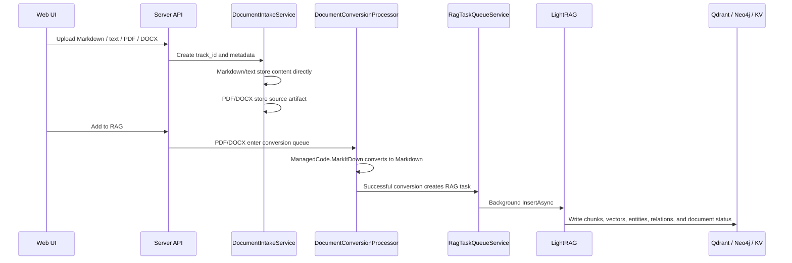
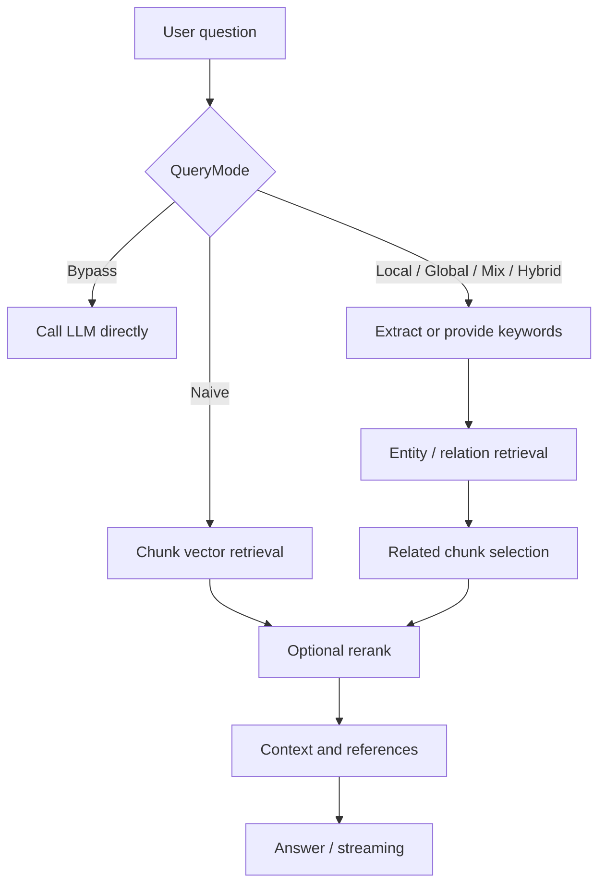

  <a href="./LightRAGNet-System-Introduction.CN.md">中文</a> | <a href="./LightRAGNet-System-Introduction.md">English</a>

# LightRAGNet System Introduction

This document reflects the current project state. LightRAGNet is no longer just a small LightRAG core demo. It is now a .NET 10 solution with Server, Web UI, document intake, background tasks, RAG Chat, a knowledge graph workbench, and test boundaries around external storage.

## 1. Positioning

LightRAGNet ports the core ideas of Python LightRAG into the .NET ecosystem and turns them into an engineering base that can keep evolving.

The project currently focuses on these points:

- Document intake should be visible and trackable, not a black-box upload.
- RAG answers should expose references, retrieval data, and diagnostics.
- Retrieval should combine chunk vectors with knowledge-graph entities, relations, and source chunks.
- The graph should be visible in the Web UI, not only hidden inside Neo4j.
- Test runs must not mutate local development Qdrant / Neo4j data.

## 2. Current Capability Snapshot

| Area | Current state |
| --- | --- |
| Document intake | Markdown, text, PDF, and DOCX are supported. PDF/DOCX files are stored as source artifacts and converted to `converted.md`. |
| Lifecycle tracking | `track_id` connects batch upload, conversion, queueing, cancellation, retry, and status refresh. |
| Indexing | Chunking, chunk embedding, entity/relation extraction, KG merge, and Qdrant/Neo4j/KV writes. |
| Query modes | `Local`, `Global`, `Mix`, `Hybrid`, `Naive`, and `Bypass` all have implementation paths. |
| Rerank | Long chunks can be split for rerank and aggregated back to the original chunk score. |
| Cache | Indexing and query paths include LLM cache; query cache is guarded by workspace revision. |
| Web UI | Blazor Server hosts RAG Chat, document management, upload, and the React graph workbench. |
| Graph workbench | React/Vite + Sigma with graph browsing, search, layout, zoom, settings, fullscreen, and graph-curation semantics. |
| Tests | Core, Server, and Web tests exist; Server tests replace real external storage by default. |

## 3. Architecture

  

The diagram follows the current code boundaries: Web UI, Server API, LightRAG Core, and Providers & Stores. Read it through three paths:

- Document intake: uploads enter `DocumentIntakeService`; PDF/DOCX files go through `DocumentConversionProcessor`; then `RagTaskQueueService` and `RagTaskProcessorService` call `LightRAG` for indexing.
- Query answer: RAG Chat calls the Server API and then `LightRAG`; `RetrievalContextService` assembles KG, vector, rerank, and reference data before LLM answer generation.
- Graph curation: the React graph workbench calls the Server API and `GraphCurationService`, which updates Neo4j graph data, Qdrant vectors, and related tracking data.

`TaskStatusHub` is the status push channel. SQLite stores document metadata and pipeline state; Qdrant, Neo4j, JSON KV, and file artifacts hold the main RAG data.

The layering is practical:

- `LightRAGNet.Core`: interfaces, models, utilities.
- `LightRAGNet.Share`: DTOs, events, request/response contracts shared by Web and Server.
- `LightRAGNet`: core orchestration, indexing, query, deletion, cache, lifecycle, and graph curation services.
- `LightRAGNet.Hosting`: dependency injection entry point.
- `LightRAGNet.Server`: API, SignalR, SQLite metadata, document artifacts, conversion processors, and storage cleanup boundaries.
- `LightRAGNet.Web`: Blazor Server UI and the embedded React/Vite graph workbench.
- `LightRAGNet.Storage`, `LLM`, `Embedding`, `Rerank`: provider implementations.

## 4. Real UI State

  

The graph workbench is one of the clearest current UI outcomes. It is not a future mockup. It is a real Knowledge Graph page inside the Web UI, with subgraph controls, node search, layout tools, zoom/focus controls, and a Sigma canvas for entities and relations.

The goal is not to wrap Neo4j Browser. Neo4j Browser is a database tool. This workbench is meant for RAG usage: inspect the generated graph after indexing, understand query structure, and keep moving toward entity merge, relationship editing, and property-level graph curation.

## 5. Document Intake Flow

Current intake is more than `upload -> InsertAsync`:

```mermaid
sequenceDiagram
    participant UI as Web UI
    participant API as Server API
    participant Intake as DocumentIntakeService
    participant Conv as DocumentConversionProcessor
    participant Queue as RagTaskQueueService
    participant Rag as LightRAG
    participant Store as Qdrant / Neo4j / KV

    UI->>API: Upload Markdown / text / PDF / DOCX
    API->>Intake: Create track_id and metadata
    Intake->>Intake: Markdown/text store content directly
    Intake->>Intake: PDF/DOCX store source artifact
    UI->>API: Add to RAG
    API->>Conv: PDF/DOCX enter conversion queue
    Conv->>Conv: ManagedCode.MarkItDown converts to Markdown
    Conv->>Queue: Successful conversion creates RAG task
    Queue->>Rag: Background InsertAsync
    Rag->>Store: Write chunks, vectors, entities, relations, and document status
```

The upside is observability: upload, conversion, indexing, failure, cancellation, and retry are visible. The cost is more state and more edge cases, so cancellation and race tests matter.

## 6. Query Flow

Queries usually come from RAG Chat, but the same capability is available through `LightRAG.QueryAsync`.

```mermaid
flowchart TD
    Query[User question] --> Mode{QueryMode}
    Mode -->|Bypass| LLM[Call LLM directly]
    Mode -->|Naive| ChunkVector[Chunk vector retrieval]
    Mode -->|Local / Global / Mix / Hybrid| Keywords[Extract or provide keywords]
    Keywords --> KG[Entity / relation retrieval]
    KG --> Chunks[Related chunk selection]
    ChunkVector --> Rerank[Optional rerank]
    Chunks --> Rerank
    Rerank --> Context[Context and references]
    Context --> Answer[Answer / streaming]
```

Mode boundaries:

- `Bypass`: no retrieval, useful for direct model checks.
- `Naive`: chunk vector only, no knowledge graph.
- `Local`: entity/direct-relation oriented.
- `Global`: relation and graph-structure oriented.
- `Mix`: combines KG retrieval and chunk vector retrieval; this is the common default.
- `Hybrid`: kept as a compatibility mode, close to Mix in behavior.

Answers can include references, diagnostics, and raw retrieval data. That is intentional: when an answer looks wrong, we should be able to inspect what was retrieved.

## 7. Storage Boundaries

LightRAGNet currently uses several storage layers:

- SQLite: Server-side document metadata and status.
- JSON KV: LightRAG workspace files such as full docs, chunks, entities, relations, and cache.
- Qdrant: vectors for chunks, entities, and relationships.
- Neo4j: entity nodes and relation edges.
- File artifacts: original PDF/DOCX files and converted Markdown.

These are not one transactional database. The project handles consistency through task state, retry paths, deletion plans, cleanup boundaries, and test isolation. Production deployment would still need stronger setup checks, health checks, backup, and permission strategy.

## 8. Deletion And Graph Curation

The project now handles more than adding documents:

- Indexed document deletion cleans document status, chunks, vectors, graph source references, and optional LLM cache.
- Dangerous clear-all paths are test-isolated and must not touch local development stores by default.
- Graph curation covers directions such as entity rename, merge, delete, relation delete, and related vector/tracking cleanup.

The core point is simple: a RAG system is not append-only. Documents get deleted, entities get merged, and graph data needs correction.

## 9. Current Boundaries

- This is still an active development project, not a hardened production template.
- Default providers target DeepSeek, DashScope, Qdrant, and Neo4j.
- The graph workbench is usable, but full graph curation is still evolving.
- Multi-store consistency is handled through engineering compensation, not distributed transactions.
- Docker Compose settings, secrets, Neo4j credentials, and volume paths must be reviewed for real environments.

## 10. Related Docs

- [README.md](./README.md)
- [RAG Task Queue Processing Solution](./RAG-Task-Queue-Processing-Solution.md)
- [中文版](./LightRAGNet-System-Introduction.CN.md)
