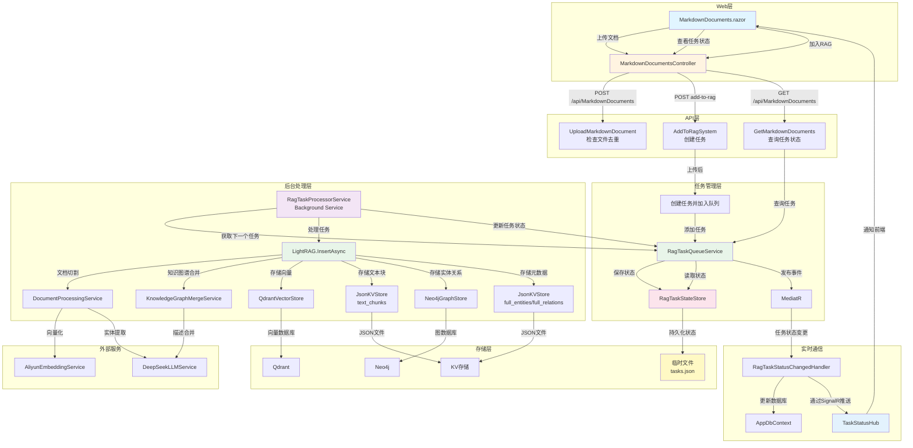
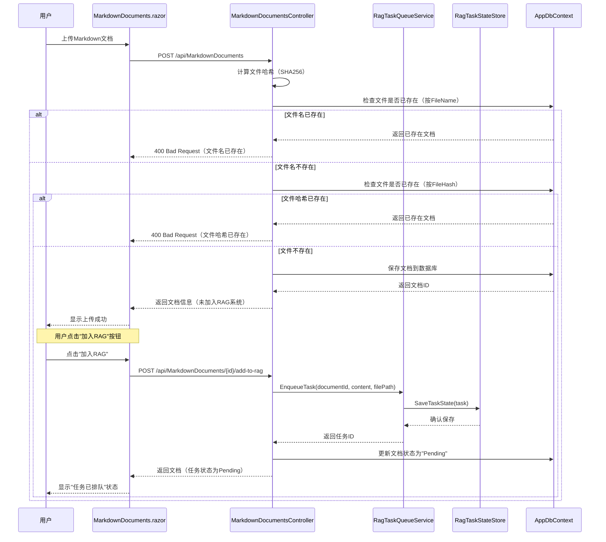
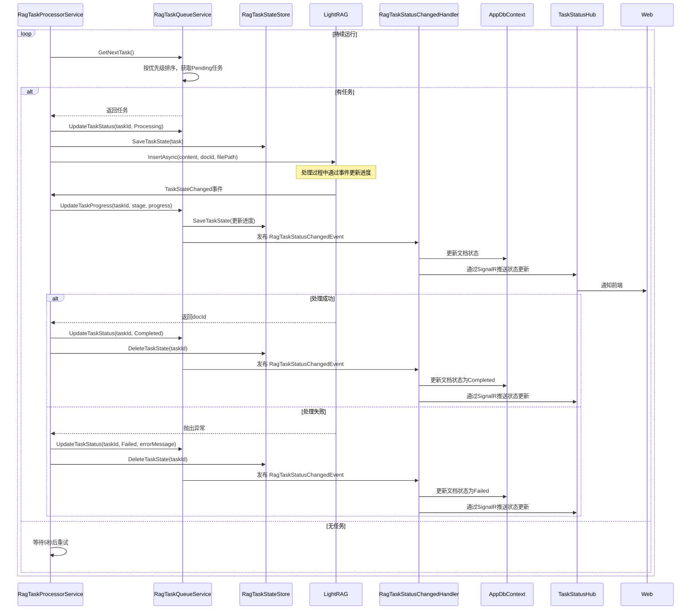
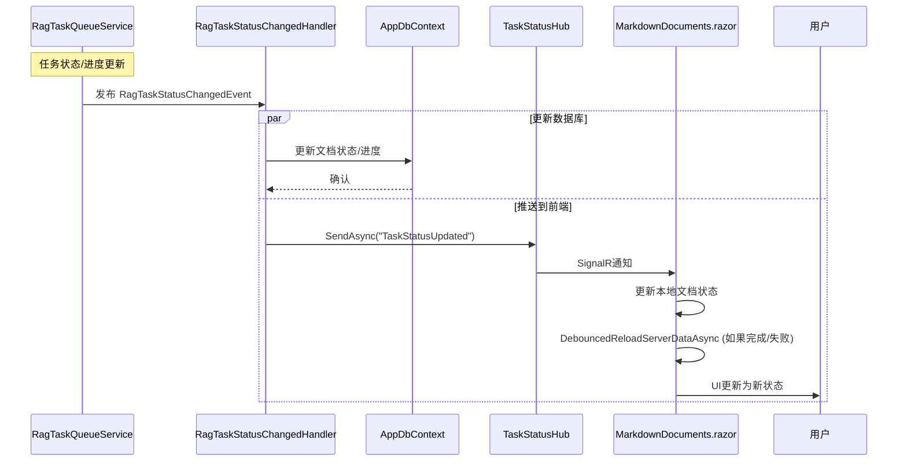
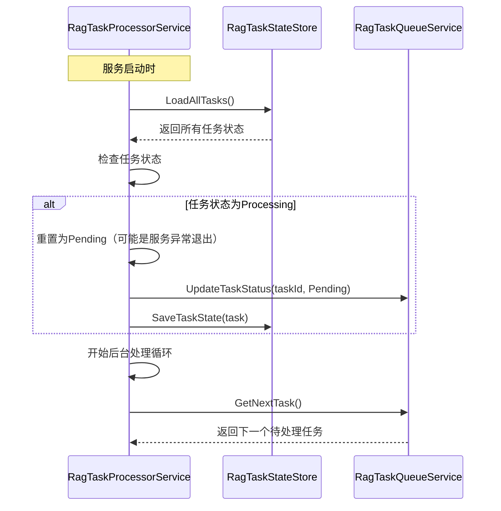

**[EN](RAG-Task-Queue-Processing-Solution.md) | [中文](RAG-Task-Queue-Processing-Solution.CN.md)**

# RAG任务队列处理方案

## 1. 系统概述

### 1.1 方案简介

本文档描述了在 `LightRAGNet` 系统中实现 RAG（Retrieval-Augmented Generation）文档处理流程的完整方案。该方案采用**后台任务队列**机制，支持任务排队、排序、删除、重试等功能，并提供任务状态持久化，确保服务重启后可以继续处理未完成的任务。

### 1.2 核心功能

- **文档切割**：将上传的 Markdown 文档按照 Token 大小进行智能切割，支持滑动窗口重叠策略
- **向量化存储**：对文档块进行向量化处理，存储到向量数据库（Qdrant）中
- **实体关系提取**：使用 LLM 从文档块中提取实体和关系信息
- **知识图谱构建**：将提取的实体和关系合并、去重，构建知识图谱并存储到图数据库（Neo4j）中
- **任务队列管理**：支持任务排队、排序调整、删除排队任务
- **进度可视化**：实时显示任务阶段和进度百分比
- **任务持久化**：任务状态保存到临时文件，服务重启后可恢复
- **文件去重**：重名文件（基于文件哈希）不允许重复上传
- **任务重试**：失败的任务可以重新执行

### 1.3 系统组件

- **`RagTaskQueueService`**：任务队列管理服务，负责任务的排队、排序、删除
- **`RagTaskProcessorService`**：后台任务处理服务（Background Service），从队列中取出任务并处理
- **`RagTaskStateStore`**：任务状态持久化服务，将任务状态保存到临时文件
- **`DocumentProcessingService`**：文档切割和块处理服务
- **`KnowledgeGraphMergeService`**：知识图谱合并服务
- **`LightRAG`**：RAG 系统主入口，协调整个处理流程
- **`MarkdownDocumentsController`**：文档管理 API 控制器
- **存储层**：向量存储（Qdrant）、图存储（Neo4j）、KV 存储（JSON 文件）

---

## 2. 系统架构图



### 2.1 架构说明

#### 2.1.1 Web层

- **`MarkdownDocuments.razor`**：前端页面组件，显示文档列表，支持文件上传、文档查看、添加文档到RAG系统，以及通过SignalR实时更新任务状态

#### 2.1.2 API层

- **`MarkdownDocumentsController`**：文档管理 API 控制器，处理：
  - 文档上传（基于原始文件名和文件哈希进行去重检查）
  - 添加文档到RAG系统（创建任务并加入队列）
  - 查询文档列表（包含任务状态信息）
  - 文档删除

#### 2.1.3 任务管理层

- **`RagTaskQueueService`**：任务队列服务，管理任务的生命周期
- **`RagTaskStateStore`**：任务状态持久化服务，确保任务状态不丢失
- **`RagTaskStatusChangedHandler`**：MediatR处理器，当任务状态变更时更新数据库并通过SignalR推送状态更新到前端

#### 2.1.4 后台处理层

- **`RagTaskProcessorService`**：后台服务，持续从队列中取出任务并处理
- **`LightRAG`**：RAG 处理核心，执行文档处理流程

#### 2.1.5 存储层

- **向量和图存储**：Qdrant 和 Neo4j 存储处理结果
- **状态文件**：临时 JSON 文件存储任务状态，支持服务重启恢复

#### 2.1.6 实时通信

- **SignalR Hub**：`TaskStatusHub` 将任务状态更新实时推送到前端
- **事件驱动更新**：任务状态变更触发数据库更新和SignalR通知

---

## 3. 数据模型设计

### 3.1 RagTask 模型

```csharp
public class RagTask
{
    /// <summary>
    /// 任务唯一标识
    /// </summary>
    public string TaskId { get; set; } = string.Empty;
    
    /// <summary>
    /// 文档ID（数据库主键）
    /// </summary>
    public int DocumentId { get; set; }
    
    /// <summary>
    /// 文档在RAG系统中的ID
    /// </summary>
    public string? RagDocumentId { get; set; }
    
    /// <summary>
    /// 文档内容
    /// </summary>
    public string Content { get; set; } = string.Empty;
    
    /// <summary>
    /// 文件路径
    /// </summary>
    public string FilePath { get; set; } = string.Empty;
    
    /// <summary>
    /// 任务状态：Pending(排队中), Processing(处理中), Completed(已完成), Failed(失败)
    /// </summary>
    public RagTaskStatus Status { get; set; } = RagTaskStatus.Pending;
    
    /// <summary>
    /// 当前处理阶段
    /// </summary>
    public TaskStage? CurrentStage { get; set; }
    
    /// <summary>
    /// 处理进度（0-100）
    /// </summary>
    public int Progress { get; set; } = 0;
    
    /// <summary>
    /// 错误信息
    /// </summary>
    public string? ErrorMessage { get; set; }
    
    /// <summary>
    /// 创建时间
    /// </summary>
    public DateTime CreatedAt { get; set; } = DateTime.UtcNow;
    
    /// <summary>
    /// 开始处理时间
    /// </summary>
    public DateTime? StartedAt { get; set; }
    
    /// <summary>
    /// 完成时间
    /// </summary>
    public DateTime? CompletedAt { get; set; }
    
    /// <summary>
    /// 队列优先级（数字越小优先级越高）
    /// </summary>
    public int Priority { get; set; } = 0;
    
    /// <summary>
    /// 重试次数
    /// </summary>
    public int RetryCount { get; set; } = 0;
    
    /// <summary>
    /// 最大重试次数
    /// </summary>
    public int MaxRetries { get; set; } = 3;
}

public enum RagTaskStatus
{
    Pending,      // 排队中
    Processing,   // 处理中
    Completed,    // 已完成
    Failed        // 失败
}
```

### 3.2 任务状态文件结构

任务状态保存在 `{WorkingDir}/tasks.json` 文件中：

```json
{
  "version": "1.0",
  "lastUpdated": "2026-01-05T10:30:00Z",
  "tasks": [
    {
      "taskId": "task-123",
      "documentId": 1,
      "ragDocumentId": "doc-abc123",
      "content": "...",
      "filePath": "/uploads/file.md",
      "status": "Processing",
      "currentStage": "ProcessingChunks",
      "progress": 45,
      "errorMessage": null,
      "createdAt": "2026-01-05T10:00:00Z",
      "startedAt": "2026-01-05T10:01:00Z",
      "completedAt": null,
      "priority": 0,
      "retryCount": 0,
      "maxRetries": 3
    }
  ]
}
```

---

## 4. 调用时序图

### 4.1 文档上传和任务创建流程



### 4.2 后台任务处理流程



### 4.3 实时状态更新流程



### 4.4 服务重启恢复流程



---

## 5. 核心服务设计

### 5.1 RagTaskQueueService

任务队列管理服务，负责任务的排队、排序、删除等操作。

#### 5.1.1 核心方法

服务提供以下关键操作：

- **`EnqueueTaskAsync`**：将文档加入处理队列，创建任务并生成唯一ID，持久化保存
- **`GetNextTaskAsync`**：根据优先级获取下一个待处理任务（数字越小优先级越高）
- **`UpdateTaskStatusAsync`**：更新任务状态（Pending → Processing → Completed/Failed）并发布事件
- **`UpdateTaskProgressAsync`**：更新任务进度和当前阶段（只有有进度追踪的阶段才显示百分比）
- **`GetTasksByDocumentIdsAsync`**：批量查询多个文档的任务状态（性能优化）
- **`StopAllTasksAsync`**：将所有 Processing 和 Pending 状态的任务标记为 Failed

#### 5.1.2 实现要点

- 使用线程安全的集合（`ConcurrentDictionary`）存储任务
- 任务按优先级排序，相同优先级按创建时间排序
- 使用 MediatR 发布任务状态变更事件（`RagTaskStatusChangedEvent`）
- 所有操作都通过 `RagTaskStateStore` 持久化
- 文件 I/O 操作移到锁外执行，减少锁竞争
- 已完成和失败的任务自动从持久化存储中删除

### 5.2 RagTaskStateStore

任务状态持久化服务，负责将任务状态保存到临时文件。

#### 5.2.1 核心方法

服务提供以下关键操作：

- **`SaveTaskStateAsync`**：保存单个任务状态到 JSON 文件（使用文件锁）
- **`LoadAllTasksAsync`**：从 JSON 文件加载所有任务状态（服务启动时使用）
- **`LoadTaskStateAsync`**：加载指定任务状态（使用内存缓存提高性能）
- **`DeleteTaskStateAsync`**：从持久化存储中删除任务（任务完成或失败时调用）

#### 5.2.2 实现要点

- 使用 JSON 文件存储任务状态（`{WorkingDir}/tasks.json`）
- 使用文件锁（`SemaphoreSlim`）确保并发安全
- 维护内存缓存（`ConcurrentDictionary`）用于快速访问
- 服务启动时自动加载任务状态
- 支持原子性写入，避免文件损坏

### 5.3 RagTaskProcessorService

后台任务处理服务，继承 `BackgroundService`，持续从队列中取出任务并处理。

#### 5.3.1 实现要点

**主处理循环**：
- 持续轮询下一个待处理任务（无任务时等待5秒后重试）
- 服务启动时恢复任务状态，将任何 `Processing` 状态的任务重置为 `Pending`

**任务处理流程**：
1. 更新任务状态为 `Processing`
2. 为任务创建作用域的 `LightRAG` 实例
3. 订阅 `TaskStateChanged` 事件以更新进度
4. 调用 `LightRAG.InsertAsync()` 处理文档
5. 根据结果更新任务状态为 `Completed` 或 `Failed`
6. 服务关闭时，将处理中的任务重置为 `Pending`，以便重启后重试

**进度追踪**：
- 只有 `Total > 0` 的阶段（ProcessingChunks、MergingEntities、MergingRelations）显示进度百分比
- 其他阶段只更新阶段名称，不更新进度值

**事件发布**：
- 任务状态变更触发 MediatR 事件（`RagTaskStatusChangedEvent`）
- 处理器更新数据库并通过 SignalR 推送状态更新到前端

---

## 6. API 设计

### 6.1 文档上传 API

#### 6.1.1 POST /api/MarkdownDocuments

上传 Markdown 文档。如果文件原始名称或文件哈希已存在，返回错误。

**请求：**
```http
POST /api/MarkdownDocuments
Content-Type: multipart/form-data

file: <file>
```

**响应：**
```json
{
  "id": 1,
  "fileName": "example.md",
  "fileSize": 1024,
  "uploadTime": "2026-01-05T10:00:00Z",
  "fileUrl": "/uploads/example_20260105100000_abc123.md",
  "fileHash": "abc123...",
  "ragStatus": null,
  "ragProgress": 0,
  "isInRagSystem": false
}
```

**错误响应（文件名已存在）：**
```json
{
  "error": "文件名已存在，不允许重复上传。已存在的文件：example.md (ID: 1)"
}
```

**错误响应（文件哈希已存在）：**
```json
{
  "error": "文件已存在，不允许重复上传。已存在的文件：example.md (ID: 1)"
}
```

**注意**：上传后，文档不会自动加入RAG系统，用户需要手动点击"加入RAG"按钮。

#### 6.1.2 POST /api/MarkdownDocuments/{id}/add-to-rag

将文档添加到RAG系统（创建任务并加入队列）。

**请求：**
```http
POST /api/MarkdownDocuments/1/add-to-rag
```

**响应：**
```json
{
  "id": 1,
  "fileName": "example.md",
  "ragStatus": "Pending",
  "ragProgress": 0,
  "isInRagSystem": false
}
```

**错误响应（文档已加入RAG系统）：**
```json
{
  "error": "文档已加入RAG系统",
  "message": "该文档已经加入RAG系统，无需重复添加。"
}
```

**错误响应（文档正在处理中）：**
```json
{
  "error": "文档正在处理中",
  "message": "该文档正在RAG处理队列中，请等待处理完成。"
}
```

#### 6.1.3 GET /api/MarkdownDocuments

获取分页的Markdown文档列表，包含任务状态信息。

**请求：**
```http
GET /api/MarkdownDocuments?page=1&pageSize=10
```

**响应：**
```json
{
  "items": [
    {
      "id": 1,
      "fileName": "example.md",
      "ragStatus": "Processing",
      "ragProgress": 45,
      "ragCurrentStage": "ProcessingChunks",
      "isInRagSystem": false
    }
  ],
  "totalCount": 100,
  "page": 1,
  "pageSize": 10,
  "totalPages": 10
}
```

**注意**：API 会自动查询状态为"Pending"或"Processing"的文档的任务状态，使用批量查询（`GetTasksByDocumentIdsAsync`）以提高性能。

#### 6.1.4 DELETE /api/MarkdownDocuments/{id}

删除Markdown文档。

**请求：**
```http
DELETE /api/MarkdownDocuments/1
```

**响应：**
```http
204 No Content
```

**注意**：如果文档有关联的任务，任务也会被删除。

---

## 7. 前端界面设计

### 7.1 文档列表页面（MarkdownDocuments.razor）

文档列表页面将文档管理和任务状态显示集成在单一界面中。

#### 7.1.1 文档列表显示

- **文档表格**：使用 MudBlazor `MudTable` 显示文档信息，支持服务器端分页
- **状态标签**：显示 RAG 状态，带颜色编码的标签：
  - Pending（灰色）
  - Processing（蓝色），带进度条和百分比（ProcessingChunks、MergingEntities、MergingRelations 阶段）
  - Completed（绿色）
  - Failed（红色）
  - 未加入（默认轮廓样式）
- **进度显示**：显示进度条和百分比（0-100%），仅在有进度追踪的阶段显示
- **阶段显示**：显示当前处理阶段（如"ProcessingChunks"、"MergingEntities"、"MergingRelations"）
- **排序**：文档自动排序，Processing/Pending 状态在前，然后是 Failed，最后是其他状态按上传时间倒序

#### 7.1.2 文档操作

- **查看按钮**：在对话框中打开文档内容
- **下载按钮**：下载原始文件（如果可用）
- **加入RAG按钮**：将文档添加到RAG系统（状态为 Processing 或 Pending 时禁用）
- **删除按钮**：删除文档（状态为 Processing 或 Pending 时禁用）
- **操作按钮**：仅图标按钮，悬停时显示文本提示

#### 7.1.3 实时更新

- **SignalR 集成**：使用 `RagTaskNotificationService` 接收实时任务状态更新
- **事件订阅**：订阅 `TaskStatusUpdated` 和 `DataCleared` 事件
- **防抖刷新**：使用防抖机制（240ms）防止频繁的表格重新加载
- **自动重新加载**：任务状态变为 Completed 或 Failed 时，自动触发 `ReloadServerData()` 以刷新和重新排序列表
- **状态管理**：立即更新本地文档状态，任务完成时从服务器重新加载

### 7.2 文档上传

- **文件上传**：支持 .md 和 .markdown 文件，最大 10MB
- **去重检查**：上传前检查原始文件名和文件哈希
- **错误处理**：文件名或哈希已存在时显示明确的错误消息
- **手动RAG添加**：上传后，文档不会自动加入RAG系统；用户必须点击"加入RAG"按钮

---

## 8. 实现步骤

### 8.1 第一阶段：核心服务实现

1. **实现 `RagTaskStateStore`**
   - 创建任务状态持久化服务
   - 实现 JSON 文件读写
   - 添加文件锁机制（`SemaphoreSlim`）
   - 实现内存缓存以快速访问

2. **实现 `RagTaskQueueService`**
   - 创建任务队列管理服务
   - 实现任务的增删改查
   - 实现任务优先级排序功能
   - 集成状态持久化
   - 实现批量查询（`GetTasksByDocumentIdsAsync`）以提高性能
   - 将文件 I/O 操作移到锁外以减少竞争

3. **实现 `RagTaskProcessorService`**
   - 创建后台处理服务
   - 实现任务处理循环
   - 实现任务恢复机制
   - 集成进度更新
   - 优雅处理服务关闭（将处理中的任务重置为 Pending）

### 8.2 第二阶段：API 实现

1. **修改文档上传 API**
   - 添加文件去重检查（基于原始文件名和文件哈希）
   - 上传成功后，文档不会自动加入RAG系统，用户需要手动点击"加入RAG"按钮

2. **添加RAG集成 API**
   - 实现 `POST /api/MarkdownDocuments/{id}/add-to-rag` 端点
   - 创建任务并加入队列
   - 更新文档状态为"Pending"

3. **增强文档列表 API**
   - 实现批量任务状态查询以提高性能
   - 自动查询状态为"Pending"或"Processing"的文档的任务状态
   - 优雅处理 `OperationCanceledException`

### 8.3 第三阶段：前端实现

1. **创建任务管理页面**
   - 实现 `TaskManagement.razor` 组件
   - 显示任务列表和进度
   - 实现拖拽排序功能

2. **增强文档上传页面**
   - 添加文件去重提示
   - 显示任务状态

3. **实现实时更新**
   - 使用轮询或 SignalR 更新任务状态

### 8.4 第四阶段：测试和优化

1. **功能测试**
   - 测试任务排队、排序、删除
   - 测试任务处理流程
   - 测试服务重启恢复

2. **性能优化**
   - 优化状态文件读写性能
   - 优化任务处理并发数
   - 添加任务处理超时机制

3. **错误处理增强**
   - 完善错误提示
   - 添加任务处理超时重试
   - 添加任务失败通知

---

## 9. 关键设计说明

### 9.1 文件去重机制

- **去重依据**：
  - 主要检查：原始文件名（`FileName`）
  - 次要检查：文件内容 SHA256 哈希值（`FileHash`）
- **检查时机**：文档上传时检查
- **处理方式**：如果文件名或哈希已存在，返回错误，不允许上传
- **注意**：上传后，文档不会自动加入RAG系统，用户需要手动点击"加入RAG"按钮

### 9.2 任务状态持久化

- **存储位置**：`{WorkingDir}/tasks.json`
- **保存时机**：
  - 任务创建时
  - 任务状态变更时
  - 任务进度更新时（有进度追踪的阶段）
- **恢复机制**：服务启动时加载所有任务状态，将 `Processing` 状态的任务重置为 `Pending`
- **清理机制**：已完成和失败的任务自动从持久化存储中删除，保持文件大小可控
- **文件 I/O 优化**：文件 I/O 操作移到锁外执行，减少锁竞争和阻塞

### 9.3 任务队列管理

- **优先级排序**：按 `Priority` 字段排序，数字越小优先级越高
- **相同优先级**：按创建时间（`CreatedAt`）排序
- **任务删除限制**：只能删除 `Pending` 状态的任务，`Processing` 状态的任务不能删除
- **任务重试**：失败的任务可以重试，但不超过 `MaxRetries` 次

### 9.4 进度跟踪机制

- **进度更新**：通过 `LightRAG.TaskStateChanged` 事件更新
- **更新频率**：每个处理阶段更新一次
- **进度计算**：基于 `TaskState.Current` 和 `TaskState.Total` 计算百分比
- **进度显示**：只有 `Total > 0` 的阶段（ProcessingChunks、MergingEntities、MergingRelations）显示进度百分比；其他阶段只显示阶段名称
- **进度参数**：`UpdateTaskProgressAsync` 接受 `int? progress` - 如果为 null，只更新阶段，不更新进度值

### 9.5 错误处理和重试

- **错误捕获**：每个处理阶段都有异常捕获
- **错误记录**：错误信息保存到任务的 `ErrorMessage` 字段
- **服务关闭处理**：服务关闭时，处理中的任务重置为 `Pending`，以便重启后重试
- **重试限制**：每个任务最多重试 `MaxRetries` 次（默认：3次）
- **重试方法**：`RetryTaskAsync` 检查重试次数并将任务重置为 `Pending` 状态

### 9.6 实时通信

- **SignalR 集成**：使用 SignalR Hub（`TaskStatusHub`）将任务状态更新推送到前端
- **事件驱动**：任务状态变更触发 MediatR 事件（`RagTaskStatusChangedEvent`），由 `RagTaskStatusChangedHandler` 处理
- **处理器职责**：
  - 更新数据库文档状态
  - 通过 SignalR 推送状态更新到前端
- **前端防抖**：使用防抖机制（240ms）防止多个更新到达时频繁重新加载表格

### 9.7 前端数据刷新策略

- **MudTable 集成**：使用 MudTable 的 `ServerData` 绑定和 `ReloadServerData()` 方法
- **防抖刷新**：实现防抖执行器（240ms）防止频繁重新加载
- **自动重新加载**：任务状态变为 Completed 或 Failed 时，自动触发 `ReloadServerData()` 以刷新和重新排序列表
- **状态管理**：立即更新本地文档状态以实现响应式 UI，任务完成时从服务器重新加载

---

## 10. 注意事项

### 10.1 并发安全

- **任务队列**：使用线程安全的集合（`ConcurrentDictionary`）存储任务
- **状态文件**：使用文件锁（`SemaphoreSlim`）确保并发写入安全
- **数据库更新**：使用 Entity Framework 事务确保数据一致性
- **锁优化**：文件 I/O 操作移到锁外执行，减少锁竞争和阻塞

### 10.2 性能考虑

- **状态文件大小**：已完成和失败的任务自动从持久化存储中删除，保持文件大小可控
- **批量查询**：使用 `GetTasksByDocumentIdsAsync` 高效批量检索任务状态
- **文件 I/O 移到锁外**：文件 I/O 操作（`SaveTaskStateAsync`、`DeleteTaskStateAsync`）在锁外执行，减少锁持有时间
- **防抖刷新**：前端使用防抖机制（240ms）防止频繁的表格重新加载
- **内存缓存**：`RagTaskStateStore` 维护内存缓存以实现快速访问

### 10.3 数据一致性

- **任务状态**：确保任务状态更新的原子性
- **文档状态**：任务完成时同步更新数据库中的文档状态
- **状态同步**：确保内存中的任务状态和文件中的状态一致
- **事件驱动更新**：使用 MediatR 事件确保数据库和 SignalR 更新原子性执行

### 10.4 服务重启恢复

- **状态恢复**：服务启动时从文件加载所有任务状态
- **处理中任务**：将 `Processing` 状态的任务重置为 `Pending` 以便重新处理（可能因服务关闭而中断）
- **已完成任务**：已完成和失败的任务自动从持久化存储中删除
- **优雅关闭**：服务关闭时的取消操作将处理中的任务重置为 Pending，以便重启后重试

### 10.5 取消处理

- **操作取消**：在 API 端点中优雅处理 `OperationCanceledException`（客户端断开连接时静默处理）
- **服务关闭**：服务关闭时，将处理中的任务重置为 Pending 状态，以便重启后重试
- **请求取消**：HTTP 请求取消时优雅处理，不向用户显示错误消息

---

## 11. 总结

本方案提供了完整的 RAG 文档处理系统设计，包括：

1. **任务队列管理**：支持任务排队、基于优先级的排序、删除和重试
2. **后台处理服务**：持续处理队列中的任务
3. **状态持久化**：任务状态保存到文件，支持服务重启恢复
4. **进度可视化**：实时显示任务阶段和进度百分比
5. **文件去重**：基于原始文件名和文件哈希防止重复上传
6. **错误处理**：完善的错误处理和重试机制
7. **实时更新**：基于 SignalR 的实时任务状态更新到前端
8. **性能优化**：批量查询、文件 I/O 移到锁外、防抖刷新机制

通过实现本方案，`LightRAGNet` 系统能够稳定、可靠地处理大量文档，并提供良好的用户体验。
