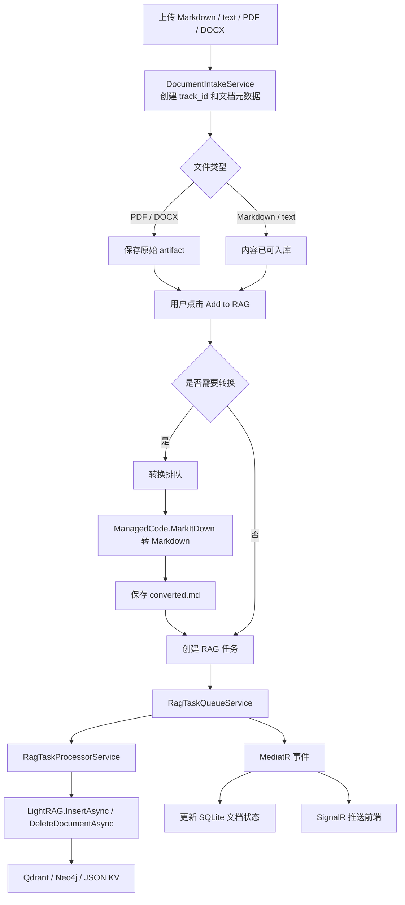
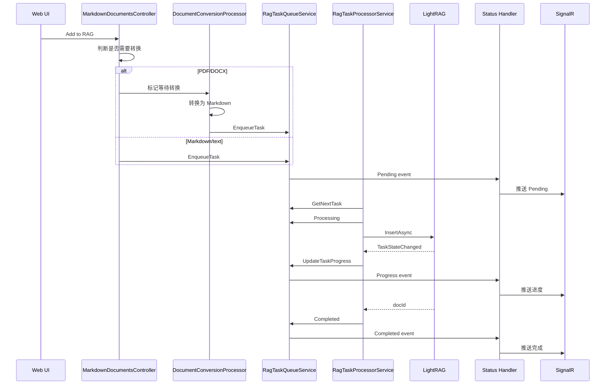

  <a href="./RAG-Task-Queue-Processing-Solution.CN.md">中文</a> | <a href="./RAG-Task-Queue-Processing-Solution.md">English</a>

# RAG 任务队列处理方案

这篇文档记录当前 RAG 任务队列的真实设计。早期文档更像实现计划，现在项目已经走到文档 intake、PDF/DOCX 转换、RAG 入库、取消、重试、删除和状态推送都串起来的阶段，所以这里按现状重写。

## 1. 为什么需要队列

文档进入 RAG 不是一个短请求。它可能要做转换、分块、embedding、实体关系抽取、图谱合并、向量写入、KV 持久化，还可能失败、取消或重试。把这些事情塞在一次 HTTP 请求里不现实。

所以现在的设计是：

- 上传只负责保存文档和元数据。
- `Add to RAG` 才进入处理链路。
- Markdown/text 可以直接进入 RAG 队列。
- PDF/DOCX 先进入转换流程，转换成 Markdown 后再进入 RAG 队列。
- 前端通过状态字段和 SignalR 观察进度。
- 队列状态持久化，服务重启后可以恢复未完成任务。

## 2. 当前状态模型

文档侧和任务侧是两层状态：

| 层级 | 作用 |
| --- | --- |
| `MarkdownDocument` | Server 数据库里的文档元数据，包含上传、转换、RAG 状态、track_id、artifact 信息。 |
| `RagTask` | RAG 后台队列里的执行任务，负责真正调用 `LightRAG.InsertAsync` 或删除任务。 |

文档状态会覆盖更完整的 intake 过程，比如：

- 上传成功但还没加入 RAG。
- PDF/DOCX 等待转换。
- 转换中、转换失败、转换完成。
- RAG 排队、处理中、完成、失败、取消。

`RagTaskStatus` 则聚焦后台任务：

- `Pending`
- `Processing`
- `Completed`
- `Failed`
- `Cancelled`

## 3. 总体链路

  

这张图把队列链路拆成两层看：上面是文档从上传到入库的主流程，下面是任务状态如何回写 SQLite、再通过 `TaskStatusHub` 推回 Web UI。红色侧线表示取消、重试、删除这些用户动作，它们不是直接改最终结果，而是和文档状态、队列状态一起协同。

```mermaid
flowchart TD
    Upload[上传 Markdown / text / PDF / DOCX] --> Intake[DocumentIntakeService<br/>创建 track_id 和文档元数据]
    Intake --> Type{文件类型}
    Type -->|Markdown / text| Ready[内容已可入库]
    Type -->|PDF / DOCX| Artifact[保存原始 artifact]
    Artifact --> AddToRag[用户点击 Add to RAG]
    Ready --> AddToRag
    AddToRag --> NeedConvert{是否需要转换}
    NeedConvert -->|是| ConvertQueued[转换排队]
    ConvertQueued --> Convert[ManagedCode.MarkItDown 转 Markdown]
    Convert --> Converted[保存 converted.md]
    Converted --> Enqueue[创建 RAG 任务]
    NeedConvert -->|否| Enqueue
    Enqueue --> Queue[RagTaskQueueService]
    Queue --> Processor[RagTaskProcessorService]
    Processor --> LightRAG[LightRAG.InsertAsync / DeleteDocumentAsync]
    LightRAG --> Stores[Qdrant / Neo4j / JSON KV]
    Queue --> Event[MediatR 事件]
    Event --> Db[更新 SQLite 文档状态]
    Event --> SignalR[SignalR 推送前端]
```

这里最关键的边界是：上传和入库分开，转换和入库分开，文档状态和任务状态分开。这样看起来多绕了一层，但后面要做取消、重试、批量处理和失败恢复，就不会全挤在一个方法里。

## 4. 核心组件

### 4.1 DocumentIntakeService

负责上传入口：

- 创建 `track_id`。
- 保存 Markdown/text 内容。
- 保存 PDF/DOCX 原始 artifact。
- 记录文件名、hash、content type、artifact path。
- 批量上传时让同一批文档共享同一个 `track_id`。

### 4.2 DocumentConversionProcessor

负责 PDF/DOCX 转 Markdown：

- 使用 `ManagedCode.MarkItDown`。
- 从 artifact store 读取原始文件。
- 生成并保存 `converted.md`。
- 写入转换状态、hash、错误信息和转换工具名称。
- 转换成功后再把 Markdown 内容交给 RAG 队列。

### 4.3 RagTaskQueueService

负责队列本身：

- 创建入库任务和删除任务。
- 按优先级和创建时间取下一个任务。
- 更新任务状态和进度。
- 支持取消、重试、删除 pending 任务。
- 通过 `RagTaskStateStore` 持久化 active task。
- 通过 MediatR 发布 `RagTaskStatusChangedEvent`。

### 4.4 RagTaskProcessorService

负责后台消费：

- 循环获取下一个 `Pending` 任务。
- 为每个任务创建作用域内的 `LightRAG`。
- 订阅 `LightRAG.TaskStateChanged`，把内部阶段映射到任务进度。
- 入库任务调用 `InsertAsync`。
- 删除任务调用 `DeleteDocumentAsync`。
- 正常结束标记 `Completed`，异常标记 `Failed`，用户取消标记 `Cancelled`。

### 4.5 RagTaskStateStore

负责把 active task 写到 `{WorkingDir}/tasks.json`：

- 服务重启后可以加载未完成任务。
- terminal 状态会从持久化文件里清理掉，避免文件越来越大。
- 写文件有锁和原子写入保护。

### 4.6 RagTaskStatusChangedHandler

负责把任务事件同步到外层：

- 更新 `MarkdownDocument` 的 RAG 状态、阶段、进度、错误信息。
- 任务完成后更新 RAG document id。
- 通过 `TaskStatusHub` 推送到前端。
- 前端收到事件后本地更新，必要时触发表格刷新。

## 5. 入库任务时序

```mermaid
sequenceDiagram
    participant UI as Web UI
    participant API as MarkdownDocumentsController
    participant Conv as DocumentConversionProcessor
    participant Queue as RagTaskQueueService
    participant Processor as RagTaskProcessorService
    participant Rag as LightRAG
    participant Handler as Status Handler
    participant Hub as SignalR

    UI->>API: Add to RAG
    API->>API: 判断是否需要转换
    alt PDF/DOCX
        API->>Conv: 标记等待转换
        Conv->>Conv: 转换为 Markdown
        Conv->>Queue: EnqueueTask
    else Markdown/text
        API->>Queue: EnqueueTask
    end
    Queue->>Handler: Pending event
    Handler->>Hub: 推送 Pending
    Processor->>Queue: GetNextTask
    Processor->>Queue: Processing
    Processor->>Rag: InsertAsync
    Rag-->>Processor: TaskStateChanged
    Processor->>Queue: UpdateTaskProgress
    Queue->>Handler: Progress event
    Handler->>Hub: 推送进度
    Rag-->>Processor: docId
    Processor->>Queue: Completed
    Queue->>Handler: Completed event
    Handler->>Hub: 推送完成
```

## 6. 取消、重试和删除

### 6.1 取消

取消不是简单改状态。当前实现里有取消注册表：

- `Pending` 任务可以直接从队列移除并发布 `Cancelled`。
- `Processing` 任务会触发对应任务 token 的取消。
- 如果转换流程里收到取消，会尽量阻止继续创建 RAG 任务。
- 前端取消后要处理成功、冲突和状态已变化的情况。

### 6.2 重试

重试面向失败或取消后的文档：

- 增加 retry count。
- 生成新的可追踪状态。
- PDF/DOCX 如果需要转换，会重新走转换或读取已有 converted artifact。
- RAG 失败任务会重新排队，但不能无限重试。

### 6.3 删除

删除分两类：

- 本地还没入库的文档：删除 SQLite 行和上传 artifact。
- 已入库文档：创建删除任务，调用 `LightRAG.DeleteDocumentAsync`，清理 chunk、向量、图谱来源引用和可选 LLM cache。

这个设计比“直接删数据库行”麻烦，但它能保护 Qdrant、Neo4j、KV 和文档元数据的一致性。

## 7. 进度阶段

`LightRAG` 内部会发布 `TaskState`，常见阶段包括：

- `DocumentChunking`
- `ProcessingChunks`
- `StoringTextChunks`
- `StoringChunkVectors`
- `MergingEntities`
- `MergingRelations`
- `UpdatingStorage`
- `Persisting`
- `DeletingDocument`
- `Completed`

只有能计算 `Current / Total` 的阶段才适合展示百分比，比如 chunk 处理、实体合并、关系合并。其他阶段更适合展示阶段文案，不硬凑进度条。

## 8. 状态持久化和恢复

服务重启时：

- 从 `tasks.json` 加载 active task。
- 如果发现 `Processing`，说明上次服务可能中断，需要回到可处理状态。
- 已完成、失败、取消的 terminal task 不长期留在 state file。

这里要注意：恢复不是魔法回滚。外部存储可能已经写了一部分，所以入库、删除和重试都要尽量幂等，至少要能识别已有状态。

## 9. 前端刷新策略

前端不是每次事件都粗暴刷新：

- SignalR 到达后先更新本地文档状态。
- 完成、失败、取消这类 terminal 状态再触发表格刷新。
- 刷新有 debounce，避免密集进度事件把 UI 打爆。
- API 支持按 `trackId` 和状态查询；当前 Web 文档列表主要暴露状态筛选，任务事件到达后再做本地更新和必要刷新。

## 10. 测试边界

这块很重要，不能省：

- Server/API 测试默认使用内存 SQLite、临时目录、no-op cleaner 和 test double。
- 默认测试不允许访问本机真实 Qdrant / Neo4j。
- `clear-all`、删除、后台任务、外部存储清理必须证明隔离。
- PDF/DOCX artifact、conversion、cancel/retry 的竞态路径要有测试兜底。

## 11. 当前限制

- 当前队列更偏单机后台队列，不是分布式任务系统。
- active task 持久化是 JSON 文件，适合当前开发阶段，不适合高并发生产调度。
- 多存储一致性依赖补偿、重试和删除计划，不是事务。
- 转换质量取决于 `ManagedCode.MarkItDown` 和输入文件质量。

## 12. 相关文档

- [README.md](./README.md)
- [LightRAGNet 系统介绍](./LightRAGNet-System-Introduction.CN.md)
- [English version](./RAG-Task-Queue-Processing-Solution.md)
