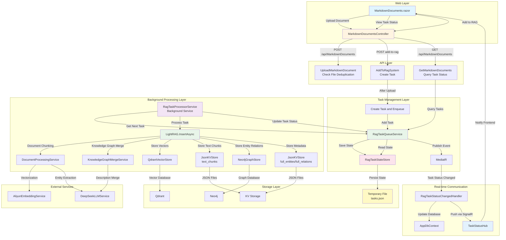
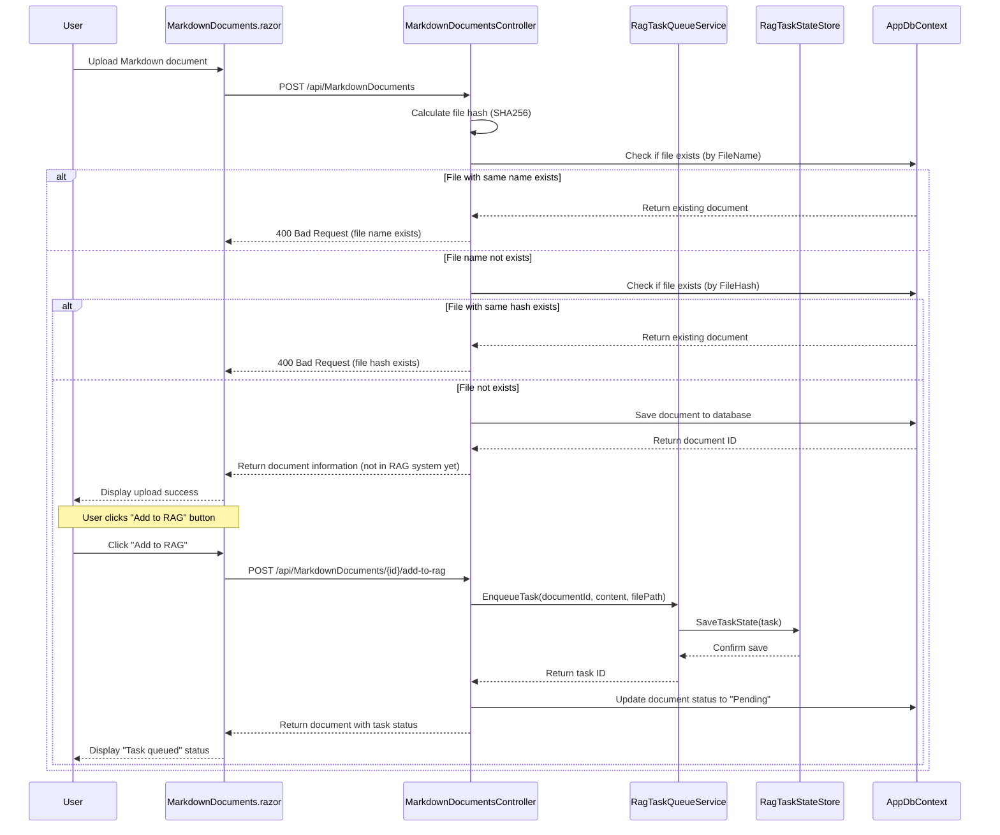
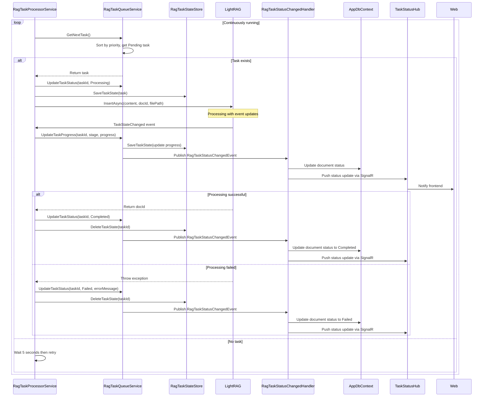
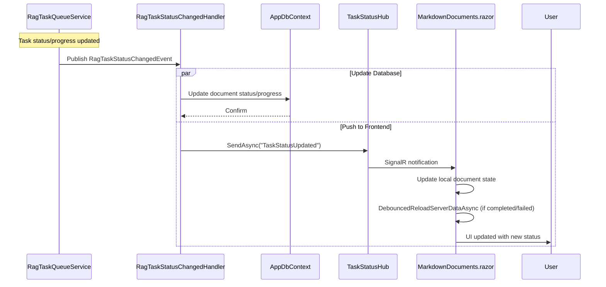
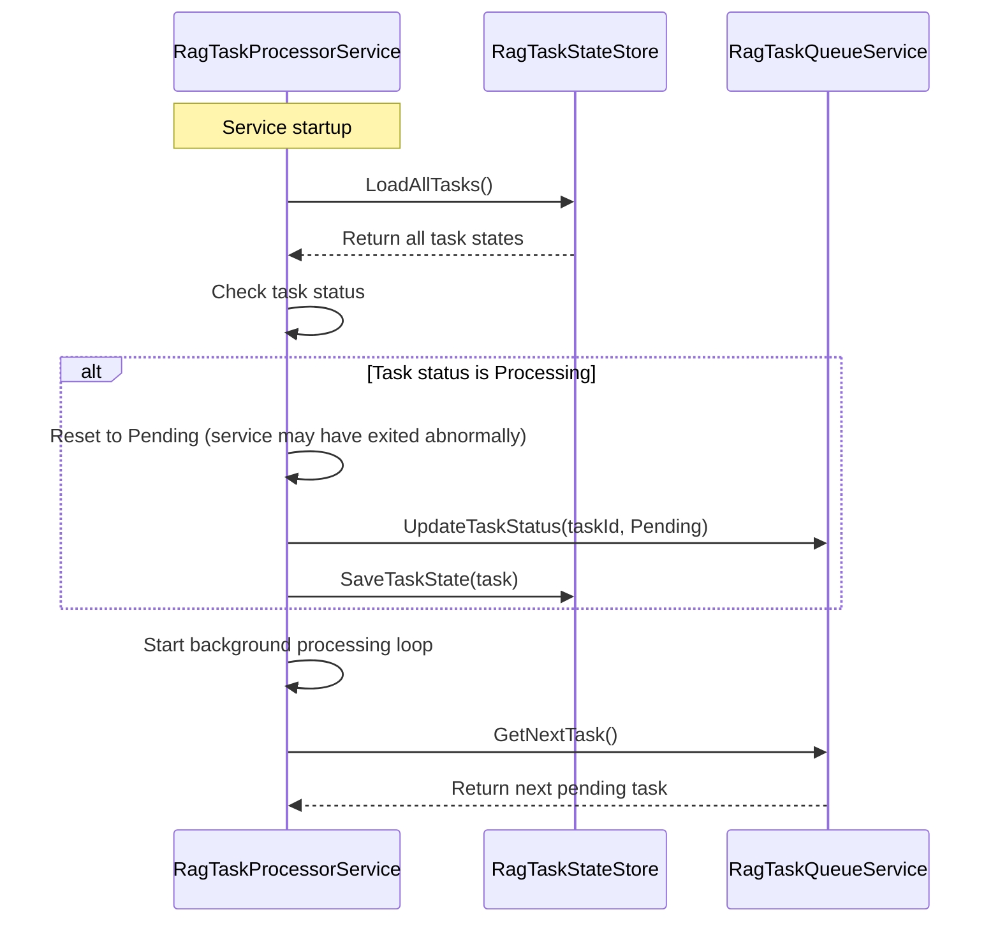

**[EN](RAG-Task-Queue-Processing-Solution.md) | [中文](RAG-Task-Queue-Processing-Solution.CN.md)**

# RAG Task Queue Processing Solution

## 1. System Overview

### 1.1 Solution Introduction

This document describes the complete solution for implementing RAG (Retrieval-Augmented Generation) document processing workflow in the `LightRAGNet` system. This solution adopts a **background task queue** mechanism, supporting task queuing, sorting, deletion, retry, and other functions, with task state persistence to ensure that unfinished tasks can continue to be processed after service restart.

### 1.2 Core Features

- **Document Chunking**: Intelligently chunk uploaded Markdown documents according to Token size, supporting sliding window overlap strategy
- **Vectorization Storage**: Vectorize document chunks and store them in the vector database (Qdrant)
- **Entity-Relationship Extraction**: Use LLM to extract entity and relationship information from document chunks
- **Knowledge Graph Construction**: Merge and deduplicate extracted entities and relationships, build knowledge graphs and store them in the graph database (Neo4j)
- **Task Queue Management**: Support task queuing, priority adjustment, and deletion of queued tasks
- **Progress Visualization**: Real-time display of task stages and progress percentages
- **Task Persistence**: Task states are saved to temporary files and can be recovered after service restart
- **File Deduplication**: Files with the same original name (based on file hash) are not allowed to be uploaded repeatedly
- **Task Retry**: Failed tasks can be re-executed

### 1.3 System Components

- **`RagTaskQueueService`**: Task queue management service, responsible for task queuing, sorting, and deletion
- **`RagTaskProcessorService`**: Background task processing service (Background Service), retrieves tasks from the queue and processes them
- **`RagTaskStateStore`**: Task state persistence service, saves task states to temporary files
- **`DocumentProcessingService`**: Document chunking and block processing service
- **`KnowledgeGraphMergeService`**: Knowledge graph merging service
- **`LightRAG`**: RAG system main entry point, coordinates the entire processing workflow
- **`MarkdownDocumentsController`**: Document management API controller
- **Storage Layer**: Vector storage (Qdrant), graph storage (Neo4j), KV storage (JSON files)

---

## 2. System Architecture



### 2.1 Architecture Description

#### 2.1.1 Web Layer

- **`MarkdownDocuments.razor`**: Frontend page component that displays the document list, supports file upload, document viewing, adding documents to RAG system, and real-time task status updates via SignalR

#### 2.1.2 API Layer

- **`MarkdownDocumentsController`**: Document management API controller that handles:
  - Document upload with file deduplication (based on original filename and file hash)
  - Adding documents to RAG system (creates tasks and enqueues them)
  - Querying document list with task status information
  - Document deletion

#### 2.1.3 Task Management Layer

- **`RagTaskQueueService`**: Task queue service that manages the lifecycle of tasks
- **`RagTaskStateStore`**: Task state persistence service that ensures task states are not lost
- **`RagTaskStatusChangedHandler`**: MediatR handler that updates database and pushes status updates to frontend via SignalR when task status changes

#### 2.1.4 Background Processing Layer

- **`RagTaskProcessorService`**: Background service that continuously retrieves tasks from the queue and processes them
- **`LightRAG`**: RAG processing core that executes the document processing workflow

#### 2.1.5 Storage Layer

- **Vector and Graph Storage**: Qdrant and Neo4j store processing results
- **State File**: Temporary JSON file stores task states, supporting service restart recovery

#### 2.1.6 Real-time Communication

- **SignalR Hub**: `TaskStatusHub` pushes task status updates to frontend in real-time
- **Event-Driven Updates**: Task status changes trigger database updates and SignalR notifications

---

## 3. Data Model Design

### 3.1 RagTask Model

```csharp
public class RagTask
{
    /// <summary>
    /// Task unique identifier
    /// </summary>
    public string TaskId { get; set; } = string.Empty;
    
    /// <summary>
    /// Document ID (database primary key)
    /// </summary>
    public int DocumentId { get; set; }
    
    /// <summary>
    /// Document ID in RAG system
    /// </summary>
    public string? RagDocumentId { get; set; }
    
    /// <summary>
    /// Document content
    /// </summary>
    public string Content { get; set; } = string.Empty;
    
    /// <summary>
    /// File path
    /// </summary>
    public string FilePath { get; set; } = string.Empty;
    
    /// <summary>
    /// Task status: Pending(queued), Processing(processing), Completed(completed), Failed(failed)
    /// </summary>
    public RagTaskStatus Status { get; set; } = RagTaskStatus.Pending;
    
    /// <summary>
    /// Current processing stage
    /// </summary>
    public TaskStage? CurrentStage { get; set; }
    
    /// <summary>
    /// Processing progress (0-100)
    /// </summary>
    public int Progress { get; set; } = 0;
    
    /// <summary>
    /// Error message
    /// </summary>
    public string? ErrorMessage { get; set; }
    
    /// <summary>
    /// Creation time
    /// </summary>
    public DateTime CreatedAt { get; set; } = DateTime.UtcNow;
    
    /// <summary>
    /// Processing start time
    /// </summary>
    public DateTime? StartedAt { get; set; }
    
    /// <summary>
    /// Completion time
    /// </summary>
    public DateTime? CompletedAt { get; set; }
    
    /// <summary>
    /// Queue priority (smaller number means higher priority)
    /// </summary>
    public int Priority { get; set; } = 0;
    
    /// <summary>
    /// Retry count
    /// </summary>
    public int RetryCount { get; set; } = 0;
    
    /// <summary>
    /// Maximum retry count
    /// </summary>
    public int MaxRetries { get; set; } = 3;
}

public enum RagTaskStatus
{
    Pending,      // Queued
    Processing,   // Processing
    Completed,    // Completed
    Failed        // Failed
}
```

### 3.2 Task State File Structure

Task states are saved in the `{WorkingDir}/tasks.json` file:

```json
{
  "version": "1.0",
  "lastUpdated": "2026-01-05T10:30:00Z",
  "tasks": [
    {
      "taskId": "task-123",
      "documentId": 1,
      "ragDocumentId": "doc-abc123",
      "content": "...",
      "filePath": "/uploads/file.md",
      "status": "Processing",
      "currentStage": "ProcessingChunks",
      "progress": 45,
      "errorMessage": null,
      "createdAt": "2026-01-05T10:00:00Z",
      "startedAt": "2026-01-05T10:01:00Z",
      "completedAt": null,
      "priority": 0,
      "retryCount": 0,
      "maxRetries": 3
    }
  ]
}
```

**Note**: Completed and failed tasks are automatically removed from the persistent storage to keep the file size manageable. Only pending and processing tasks are persisted.

---

## 4. Call Sequence Diagrams

### 4.1 Document Upload and Task Creation Flow



### 4.2 Background Task Processing Flow



### 4.3 Real-time Status Update Flow



### 4.4 Service Restart Recovery Flow



---

## 5. Core Service Design

### 5.1 RagTaskQueueService

Task queue management service responsible for task queuing, sorting, deletion, and other operations.

#### 5.1.1 Core Methods

The service provides the following key operations:

- **`EnqueueTaskAsync`**: Adds a document to the processing queue, creates a task with unique ID, and persists it
- **`GetNextTaskAsync`**: Retrieves the next pending task based on priority (lower number = higher priority)
- **`UpdateTaskStatusAsync`**: Updates task status (Pending → Processing → Completed/Failed) and publishes events
- **`UpdateTaskProgressAsync`**: Updates task progress and current stage (only stages with progress tracking show percentages)
- **`GetTasksByDocumentIdsAsync`**: Batch queries task statuses for multiple documents (performance optimization)
- **`StopAllTasksAsync`**: Marks all Processing and Pending tasks as Failed

#### 5.1.2 Implementation Points

- Uses thread-safe collections (e.g., `ConcurrentDictionary`) to store tasks
- Tasks are sorted by priority, with same priority sorted by creation time
- Uses MediatR to publish task status change events (`RagTaskStatusChangedEvent`)
- All operations are persisted through `RagTaskStateStore`
- File I/O operations are moved outside the lock to reduce lock contention
- Completed and failed tasks are automatically removed from persistent storage

### 5.2 RagTaskStateStore

Task state persistence service responsible for saving task states to temporary files.

#### 5.2.1 Core Methods

The service provides the following key operations:

- **`SaveTaskStateAsync`**: Saves a single task state to JSON file with file locking
- **`LoadAllTasksAsync`**: Loads all task states from JSON file (used on service startup)
- **`LoadTaskStateAsync`**: Loads a specific task state (with in-memory cache for performance)
- **`DeleteTaskStateAsync`**: Removes a task from persistent storage (called when task completes/fails)

#### 5.2.2 Implementation Points

- Uses JSON file to store task states (`{WorkingDir}/tasks.json`)
- Uses file locks (`SemaphoreSlim`) to ensure concurrent safety
- Maintains an in-memory cache (`ConcurrentDictionary`) for fast access
- Automatically loads task states on service startup
- Supports atomic writes to avoid file corruption

### 5.3 RagTaskProcessorService

Background task processing service that inherits from `BackgroundService` and continuously retrieves tasks from the queue and processes them.

#### 5.3.1 Implementation Points

**Main Processing Loop**:
- Continuously polls for next pending task (waits 5 seconds if no tasks available)
- On service startup, restores task states and resets any `Processing` tasks to `Pending`

**Task Processing Flow**:
1. Updates task status to `Processing`
2. Creates a scoped `LightRAG` instance for the task
3. Subscribes to `TaskStateChanged` events for progress updates
4. Calls `LightRAG.InsertAsync()` to process the document
5. Updates task status to `Completed` or `Failed` based on result
6. On service shutdown, resets processing tasks to `Pending` for retry after restart

**Progress Tracking**:
- Only stages with `Total > 0` (ProcessingChunks, MergingEntities, MergingRelations) display progress percentages
- Other stages only update the stage name, not the progress value

**Event Publishing**:
- Task status changes trigger MediatR events (`RagTaskStatusChangedEvent`)
- Handler updates database and pushes status updates to frontend via SignalR

---

## 6. API Design

### 6.1 Document Upload API

#### 6.1.1 POST /api/MarkdownDocuments

Upload Markdown document. If a file with the same original name or file hash exists, returns an error.

**Request:**
```http
POST /api/MarkdownDocuments
Content-Type: multipart/form-data

file: <file>
```

**Response:**
```json
{
  "id": 1,
  "fileName": "example.md",
  "fileSize": 1024,
  "uploadTime": "2026-01-05T10:00:00Z",
  "fileUrl": "/uploads/example_20260105100000_abc123.md",
  "fileHash": "abc123...",
  "ragStatus": null,
  "ragProgress": 0,
  "isInRagSystem": false
}
```

**Error Response (file name exists):**
```json
{
  "error": "文件名已存在，不允许重复上传。已存在的文件：example.md (ID: 1)"
}
```

**Error Response (file hash exists):**
```json
{
  "error": "文件已存在，不允许重复上传。已存在的文件：example.md (ID: 1)"
}
```

**Note**: After upload, documents are not automatically added to the RAG system. Users must manually click the "Add to RAG" button.

#### 6.1.2 POST /api/MarkdownDocuments/{id}/add-to-rag

Add a document to the RAG system (creates a task and enqueues it).

**Request:**
```http
POST /api/MarkdownDocuments/1/add-to-rag
```

**Response:**
```json
{
  "id": 1,
  "fileName": "example.md",
  "ragStatus": "Pending",
  "ragProgress": 0,
  "isInRagSystem": false
}
```

**Error Response (document already in RAG system):**
```json
{
  "error": "文档已加入RAG系统",
  "message": "该文档已经加入RAG系统，无需重复添加。"
}
```

**Error Response (document is processing):**
```json
{
  "error": "文档正在处理中",
  "message": "该文档正在RAG处理队列中，请等待处理完成。"
}
```

#### 6.1.3 GET /api/MarkdownDocuments

Get paginated list of Markdown documents with task status information.

**Request:**
```http
GET /api/MarkdownDocuments?page=1&pageSize=10
```

**Response:**
```json
{
  "items": [
    {
      "id": 1,
      "fileName": "example.md",
      "ragStatus": "Processing",
      "ragProgress": 45,
      "ragCurrentStage": "ProcessingChunks",
      "isInRagSystem": false
    }
  ],
  "totalCount": 100,
  "page": 1,
  "pageSize": 10,
  "totalPages": 10
}
```

**Note**: The API automatically queries task statuses for documents with "Pending" or "Processing" status using batch querying (`GetTasksByDocumentIdsAsync`) for better performance.

#### 6.1.4 DELETE /api/MarkdownDocuments/{id}

Delete a Markdown document.

**Request:**
```http
DELETE /api/MarkdownDocuments/1
```

**Response:**
```http
204 No Content
```

**Note**: If the document has an associated task, the task will also be deleted.

---

## 7. Frontend Interface Design

### 7.1 Document List Page (MarkdownDocuments.razor)

The document list page integrates document management and task status display in a single interface.

#### 7.1.1 Document List Display

- **Document Table**: Displays document information using MudBlazor `MudTable` with server-side pagination
- **Status Chips**: Shows RAG status with color-coded chips:
  - Pending (gray)
  - Processing (blue) with progress bar and percentage for ProcessingChunks, MergingEntities, MergingRelations stages
  - Completed (green)
  - Failed (red)
  - Not added (default outlined)
- **Progress Display**: Shows progress bar and percentage (0-100%) for stages with progress tracking
- **Stage Display**: Shows current processing stage (e.g., "ProcessingChunks", "MergingEntities", "MergingRelations")
- **Sorting**: Documents are automatically sorted with Processing/Pending status first, then Failed, then others by upload time

#### 7.1.2 Document Operations

- **View Button**: Opens document content in a dialog
- **Download Button**: Downloads the original file (if available)
- **Add to RAG Button**: Adds document to RAG system (disabled when status is Processing or Pending)
- **Delete Button**: Deletes document (disabled when status is Processing or Pending)
- **Action Buttons**: Icon-only buttons with text tooltips on hover

#### 7.1.3 Real-time Updates

- **SignalR Integration**: Uses `RagTaskNotificationService` to receive real-time task status updates
- **Event Subscription**: Subscribes to `TaskStatusUpdated` and `DataCleared` events
- **Debounced Refresh**: Uses debounce mechanism (240ms) to prevent frequent table reloads when multiple updates arrive
- **Automatic Reload**: When task status changes to Completed or Failed, automatically triggers `ReloadServerData()` to refresh and reorder the list
- **State Management**: Updates local document state immediately, then reloads from server when task completes

### 7.2 Document Upload

- **File Upload**: Supports .md and .markdown files up to 10MB
- **Deduplication Check**: Checks both original filename and file hash before allowing upload
- **Error Handling**: Clear error messages when file name or hash already exists
- **Manual RAG Addition**: After upload, documents are not automatically added to RAG system; users must click "Add to RAG" button

---

## 8. Implementation Steps

### 8.1 Phase 1: Core Service Implementation

1. **Implement `RagTaskStateStore`**
   - Create task state persistence service
   - Implement JSON file read/write
   - Add file lock mechanism (`SemaphoreSlim`)
   - Implement in-memory cache for fast access

2. **Implement `RagTaskQueueService`**
   - Create task queue management service
   - Implement task CRUD operations
   - Implement task priority sorting
   - Integrate state persistence
   - Implement batch querying (`GetTasksByDocumentIdsAsync`) for performance
   - Move file I/O operations outside locks to reduce contention

3. **Implement `RagTaskProcessorService`**
   - Create background processing service
   - Implement task processing loop
   - Implement task recovery mechanism
   - Integrate progress updates
   - Handle service shutdown gracefully (reset tasks to Pending)

### 8.2 Phase 2: API Implementation

1. **Modify Document Upload API**
   - Add file deduplication check (based on original filename and file hash)
   - After successful upload, documents are not automatically added to RAG system
   - Users must manually click "Add to RAG" button

2. **Add RAG Integration API**
   - Implement `POST /api/MarkdownDocuments/{id}/add-to-rag` endpoint
   - Creates task and enqueues it
   - Updates document status to "Pending"

3. **Enhance Document List API**
   - Implement batch task status querying for better performance
   - Automatically query task statuses for documents with "Pending" or "Processing" status
   - Handle `OperationCanceledException` gracefully

### 8.3 Phase 3: Frontend Implementation

1. **Enhance Document List Page**
   - Implement `MarkdownDocuments.razor` component
   - Display document list with task status and progress
   - Integrate SignalR for real-time updates
   - Implement debounced refresh mechanism (240ms)
   - Add icon-only action buttons with tooltips

2. **Implement Real-time Updates**
   - Use SignalR to receive task status updates
   - Subscribe to `TaskStatusUpdated` and `DataCleared` events
   - Update local state immediately, reload from server when task completes
   - Use MudTable's `ReloadServerData()` mechanism for data refresh

### 8.4 Phase 4: Testing and Optimization

1. **Functionality Testing**
   - Test task queuing and processing
   - Test task processing workflow
   - Test service restart recovery
   - Test file deduplication
   - Test real-time status updates via SignalR

2. **Performance Optimization**
   - Optimize state file read/write performance (move I/O outside locks)
   - Implement batch task status querying
   - Implement debounced refresh to prevent frequent reloads

3. **Error Handling Enhancement**
   - Improve error messages
   - Handle cancellation gracefully
   - Handle network errors gracefully

---

## 9. Key Design Notes

### 9.1 File Deduplication Mechanism

- **Deduplication Criteria**: 
  - Primary check: Original filename (`FileName`)
  - Secondary check: File content SHA256 hash (`FileHash`)
- **Check Timing**: Checked during document upload
- **Processing**: If a file with the same name or hash exists, return an error and disallow upload
- **Note**: Documents are not automatically added to RAG system after upload; users must manually click "Add to RAG"

### 9.2 Task State Persistence

- **Storage Location**: `{WorkingDir}/tasks.json`
- **Save Timing**:
  - When task is created
  - When task status changes
  - When task progress updates (for stages with progress tracking)
- **Recovery Mechanism**: On service startup, load all tasks and reset `Processing` status tasks to `Pending`
- **Cleanup**: Completed and failed tasks are automatically removed from persistent storage to keep file size manageable
- **File I/O Optimization**: File I/O operations are moved outside locks to reduce lock contention and prevent blocking

### 9.3 Task Queue Management

- **Priority Sorting**: Tasks sorted by `Priority` field (smaller number means higher priority)
- **Same Priority**: Sorted by creation time (`CreatedAt`)
- **Task Deletion Restriction**: Can only delete `Pending` status tasks; `Processing` status tasks cannot be deleted
- **Task Retry**: Failed tasks can be retried, but not exceeding `MaxRetries` times
- **Batch Querying**: Uses `GetTasksByDocumentIdsAsync` for efficient batch retrieval of task statuses

### 9.4 Progress Tracking Mechanism

- **Progress Updates**: Updated through `LightRAG.TaskStateChanged` events
- **Update Frequency**: Updated for each processing stage
- **Progress Calculation**: Based on `TaskState.Current` and `TaskState.Total` to calculate percentage
- **Progress Display**: Only stages with `Total > 0` (ProcessingChunks, MergingEntities, MergingRelations) display progress percentage; other stages only show stage name
- **Progress Parameter**: `UpdateTaskProgressAsync` accepts `int? progress` - if null, only updates stage, not progress value

### 9.5 Error Handling and Retry

- **Error Capture**: Each processing stage has exception handling
- **Error Recording**: Error messages saved to task's `ErrorMessage` field
- **Service Shutdown Handling**: When service shuts down, tasks in processing are reset to `Pending` for retry after restart
- **Retry Limitation**: Each task can retry at most `MaxRetries` times (default: 3)
- **Retry Method**: `RetryTaskAsync` checks retry count and resets task to `Pending` status

### 9.6 Real-time Communication

- **SignalR Integration**: Uses SignalR Hub (`TaskStatusHub`) to push task status updates to frontend
- **Event-Driven**: Task status changes trigger MediatR events (`RagTaskStatusChangedEvent`), which are handled by `RagTaskStatusChangedHandler`
- **Handler Responsibilities**: 
  - Updates database document status
  - Pushes status updates to frontend via SignalR
- **Frontend Debouncing**: Uses debounce mechanism (240ms) to prevent frequent table reloads when multiple updates arrive

### 9.7 Frontend Data Refresh Strategy

- **MudTable Integration**: Uses MudTable's `ServerData` binding and `ReloadServerData()` method
- **Debounced Refresh**: Implements debounce executor (240ms) to prevent frequent reloads
- **Automatic Reload**: When task status changes to Completed or Failed, automatically triggers `ReloadServerData()` to refresh and reorder the list
- **State Management**: Updates local document state immediately for responsive UI, then reloads from server when task completes

---

## 10. Important Notes

### 10.1 Concurrency Safety

- **Task Queue**: Uses thread-safe collections (`ConcurrentDictionary`) to store tasks
- **State File**: Uses file locks (`SemaphoreSlim`) to ensure concurrent write safety
- **Database Updates**: Uses Entity Framework transactions to ensure data consistency
- **Lock Optimization**: File I/O operations are moved outside locks to reduce lock contention and prevent blocking

### 10.2 Performance Considerations

- **State File Size**: Completed and failed tasks are automatically removed from persistent storage to keep file size manageable
- **Batch Querying**: Uses `GetTasksByDocumentIdsAsync` for efficient batch retrieval of task statuses
- **File I/O Outside Locks**: File I/O operations (`SaveTaskStateAsync`, `DeleteTaskStateAsync`) are performed outside the lock to reduce lock holding time
- **Debounced Refresh**: Frontend uses debounce mechanism (240ms) to prevent frequent table reloads
- **In-Memory Cache**: `RagTaskStateStore` maintains an in-memory cache for fast access

### 10.3 Data Consistency

- **Task Status**: Ensures atomicity of task status updates
- **Document Status**: Task completion synchronously updates document status in database
- **State Synchronization**: Ensures consistency between in-memory task state and file state
- **Event-Driven Updates**: Uses MediatR events to ensure database and SignalR updates happen atomically

### 10.4 Service Restart Recovery

- **State Recovery**: On service startup, loads all task states from file
- **Processing Tasks**: Resets `Processing` status tasks to `Pending` for reprocessing (may have been interrupted by service shutdown)
- **Completed Tasks**: Completed and failed tasks are automatically removed from persistent storage
- **Graceful Shutdown**: Service shutdown cancellation resets processing tasks to Pending for retry after restart

### 10.5 Cancellation Handling

- **Operation Canceled**: `OperationCanceledException` is handled gracefully in API endpoints (silent handling for client disconnections)
- **Service Shutdown**: When service shuts down, processing tasks are reset to Pending status for retry after restart
- **Request Cancellation**: HTTP request cancellations are handled gracefully without showing error messages to users

---

## 11. Summary

This solution provides a complete RAG document processing system design, including:

1. **Task Queue Management**: Supports task queuing, priority-based sorting, deletion, and retry
2. **Background Processing Service**: Continuously processes tasks from the queue
3. **State Persistence**: Task states saved to files, supporting service restart recovery
4. **Progress Visualization**: Real-time display of task stages and progress percentages
5. **File Deduplication**: Prevents duplicate uploads based on original filename and file hash
6. **Error Handling**: Comprehensive error handling and retry mechanism
7. **Real-time Updates**: SignalR-based real-time task status updates to frontend
8. **Performance Optimization**: Batch querying, file I/O outside locks, and debounced refresh mechanisms

By implementing this solution, the `LightRAGNet` system can stably and reliably process large volumes of documents and provide a good user experience.
