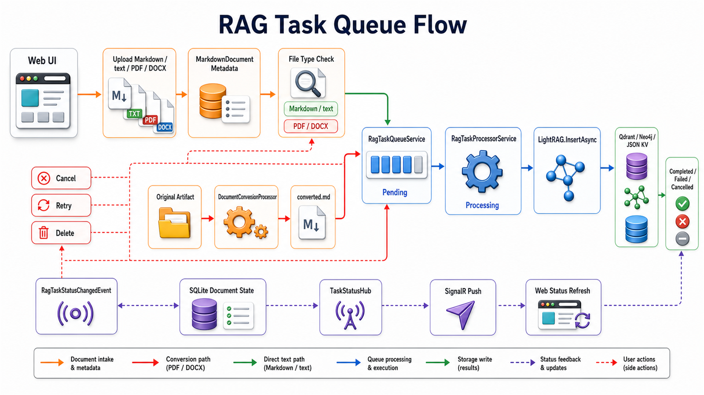
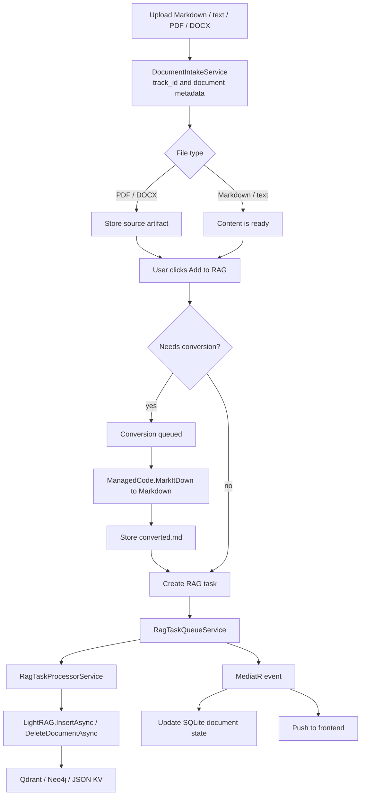
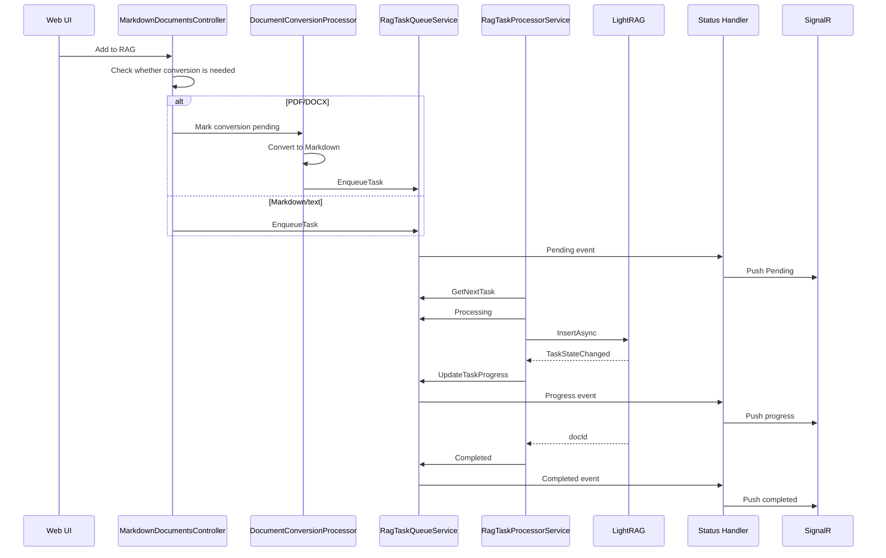

  <a href="./RAG-Task-Queue-Processing-Solution.CN.md">中文</a> | <a href="./RAG-Task-Queue-Processing-Solution.md">English</a>

# RAG Task Queue Processing Solution

This document describes the current task-queue design. The old version read more like an implementation plan. The project now has document intake, PDF/DOCX conversion, RAG indexing, cancellation, retry, deletion, and real-time status updates wired together, so this version documents the actual shape of the system.

## 1. Why The Queue Exists

Indexing a document into RAG is not a short HTTP request. It may include conversion, chunking, embedding, entity/relation extraction, graph merge, vector writes, KV persistence, failure handling, cancellation, and retry.

The current design is:

- Upload stores documents and metadata.
- `Add to RAG` starts the processing chain.
- Markdown/text can go directly to the RAG queue.
- PDF/DOCX first go through conversion, then enter the RAG queue.
- The frontend observes status through document fields and SignalR.
- Active queue state is persisted so unfinished work can recover after restart.

## 2. Current State Model

There are two state layers:

| Layer | Purpose |
| --- | --- |
| `MarkdownDocument` | Server-side document metadata, upload state, conversion state, RAG state, `track_id`, and artifact metadata. |
| `RagTask` | Background RAG task that calls `LightRAG.InsertAsync` or runs a delete operation. |

Document status covers the broader intake lifecycle:

- Uploaded but not added to RAG.
- PDF/DOCX waiting for conversion.
- Conversion processing, failed, or completed.
- RAG pending, processing, completed, failed, or cancelled.

`RagTaskStatus` focuses on background execution:

- `Pending`
- `Processing`
- `Completed`
- `Failed`
- `Cancelled`

## 3. Overall Flow

  

The image separates the flow into two layers: the main document-to-indexing path on top, and the status feedback path underneath. The red side path represents user actions such as cancel, retry, and delete; those actions coordinate with document state and queue state instead of directly mutating the final RAG stores.

```mermaid
flowchart TD
    Upload[Upload Markdown / text / PDF / DOCX] --> Intake[DocumentIntakeService<br/>track_id and document metadata]
    Intake --> Type{File type}
    Type -->|Markdown / text| Ready[Content is ready]
    Type -->|PDF / DOCX| Artifact[Store source artifact]
    Artifact --> AddToRag[User clicks Add to RAG]
    Ready --> AddToRag
    AddToRag --> NeedConvert{Needs conversion?}
    NeedConvert -->|yes| ConvertQueued[Conversion queued]
    ConvertQueued --> Convert[ManagedCode.MarkItDown to Markdown]
    Convert --> Converted[Store converted.md]
    Converted --> Enqueue[Create RAG task]
    NeedConvert -->|no| Enqueue
    Enqueue --> Queue[RagTaskQueueService]
    Queue --> Processor[RagTaskProcessorService]
    Processor --> LightRAG[LightRAG.InsertAsync / DeleteDocumentAsync]
    LightRAG --> Stores[Qdrant / Neo4j / JSON KV]
    Queue --> Event[MediatR event]
    Event --> Db[Update SQLite document state]
    Event --> SignalR[Push to frontend]
```

The important boundary is this: upload, conversion, indexing, document state, and task state are separate. That extra structure pays for itself when cancellation, retry, batch upload, and recovery enter the picture.

## 4. Core Components

### 4.1 DocumentIntakeService

Handles upload intake:

- Creates `track_id`.
- Stores Markdown/text content.
- Stores PDF/DOCX source artifacts.
- Records filename, hash, content type, and artifact path.
- Keeps a shared `track_id` for batch uploads.

### 4.2 DocumentConversionProcessor

Handles PDF/DOCX conversion:

- Uses `ManagedCode.MarkItDown`.
- Reads source files from the artifact store.
- Generates and stores `converted.md`.
- Writes conversion status, hash, error message, and conversion tool name.
- Creates a RAG task only after conversion succeeds.

### 4.3 RagTaskQueueService

Owns the queue:

- Creates indexing tasks and deletion tasks.
- Picks the next task by priority and creation time.
- Updates task status and progress.
- Supports cancellation, retry, and pending-task deletion.
- Persists active tasks through `RagTaskStateStore`.
- Publishes `RagTaskStatusChangedEvent` through MediatR.

### 4.4 RagTaskProcessorService

Consumes the queue:

- Polls the next `Pending` task.
- Creates a scoped `LightRAG` instance per task.
- Subscribes to `LightRAG.TaskStateChanged`.
- Calls `InsertAsync` for indexing tasks.
- Calls `DeleteDocumentAsync` for delete tasks.
- Marks tasks as `Completed`, `Failed`, or `Cancelled`.

### 4.5 RagTaskStateStore

Persists active tasks to `{WorkingDir}/tasks.json`:

- Unfinished tasks can be loaded on restart.
- Terminal states are cleaned from the state file.
- Writes are protected by locking and atomic file replacement.

### 4.6 RagTaskStatusChangedHandler

Synchronizes task events outward:

- Updates `MarkdownDocument` RAG status, stage, progress, and error message.
- Writes the RAG document id after completion.
- Pushes updates through `TaskStatusHub`.
- Lets the frontend update local state and refresh when needed.

## 5. Indexing Sequence

```mermaid
sequenceDiagram
    participant UI as Web UI
    participant API as MarkdownDocumentsController
    participant Conv as DocumentConversionProcessor
    participant Queue as RagTaskQueueService
    participant Processor as RagTaskProcessorService
    participant Rag as LightRAG
    participant Handler as Status Handler
    participant Hub as SignalR

    UI->>API: Add to RAG
    API->>API: Check whether conversion is needed
    alt PDF/DOCX
        API->>Conv: Mark conversion pending
        Conv->>Conv: Convert to Markdown
        Conv->>Queue: EnqueueTask
    else Markdown/text
        API->>Queue: EnqueueTask
    end
    Queue->>Handler: Pending event
    Handler->>Hub: Push Pending
    Processor->>Queue: GetNextTask
    Processor->>Queue: Processing
    Processor->>Rag: InsertAsync
    Rag-->>Processor: TaskStateChanged
    Processor->>Queue: UpdateTaskProgress
    Queue->>Handler: Progress event
    Handler->>Hub: Push progress
    Rag-->>Processor: docId
    Processor->>Queue: Completed
    Queue->>Handler: Completed event
    Handler->>Hub: Push completed
```

## 6. Cancellation, Retry, And Deletion

### 6.1 Cancellation

Cancellation is not just a status update:

- `Pending` tasks can be removed and published as `Cancelled`.
- `Processing` tasks cancel their registered task token.
- Conversion cancellation tries to prevent a RAG task from being created afterward.
- The frontend must handle success, conflict, and already-moved states.

### 6.2 Retry

Retry applies to failed or cancelled documents:

- Retry count is incremented.
- A new trackable state is created.
- PDF/DOCX can convert again or reuse existing converted artifacts.
- RAG failures re-enter the queue but cannot retry forever.

### 6.3 Deletion

Deletion has two cases:

- Local-only documents: remove the SQLite row and uploaded artifacts.
- Indexed documents: create a delete task, call `LightRAG.DeleteDocumentAsync`, and clean chunks, vectors, graph source references, and optional LLM cache.

This is more work than deleting one row, but it keeps Qdrant, Neo4j, KV files, artifacts, and metadata from drifting apart.

## 7. Progress Stages

Common `LightRAG` task stages include:

- `DocumentChunking`
- `ProcessingChunks`
- `StoringTextChunks`
- `StoringChunkVectors`
- `MergingEntities`
- `MergingRelations`
- `UpdatingStorage`
- `Persisting`
- `DeletingDocument`
- `Completed`

Only stages with a meaningful `Current / Total` should show percentages. Chunk processing, entity merging, and relation merging are good examples. Other stages should show the stage name without pretending to have exact progress.

## 8. Persistence And Recovery

On restart:

- Active tasks are loaded from `tasks.json`.
- `Processing` means the service may have stopped mid-task, so it must be brought back to a processable state.
- Terminal tasks are not kept in the state file forever.

Recovery is not magic rollback. External stores may already contain partial writes, so indexing, deletion, and retry paths need to be as idempotent as practical.

## 9. Frontend Refresh Strategy

The frontend avoids brute-force reloads:

- SignalR updates local document state first.
- Terminal states trigger a table refresh.
- Refreshes are debounced so dense progress events do not overload the UI.
- The API supports `trackId` and status filters; the current Web document list mainly exposes status filtering, then applies local task updates and refreshes when needed.

## 10. Test Boundary

This part is non-negotiable:

- Server/API tests use in-memory SQLite, temporary directories, no-op cleaners, and test doubles by default.
- Default tests must not access local development Qdrant / Neo4j.
- `clear-all`, deletion, background tasks, and external storage cleanup must prove isolation.
- PDF/DOCX artifacts, conversion, cancellation, retry, and race paths need regression tests.

## 11. Current Limits

- The queue is a single-machine background queue, not a distributed task system.
- Active task persistence uses JSON files, which is good enough for the current development stage but not for high-concurrency production scheduling.
- Multi-store consistency is handled through compensation, retry, and deletion plans, not transactions.
- Conversion quality depends on `ManagedCode.MarkItDown` and input document quality.

## 12. Related Docs

- [README.md](./README.md)
- [LightRAGNet System Introduction](./LightRAGNet-System-Introduction.md)
- [中文版](./RAG-Task-Queue-Processing-Solution.CN.md)
