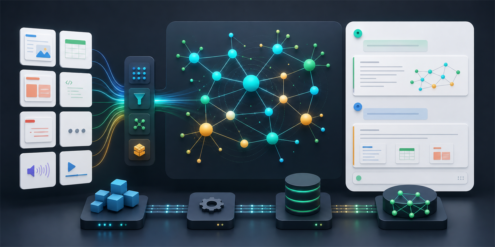
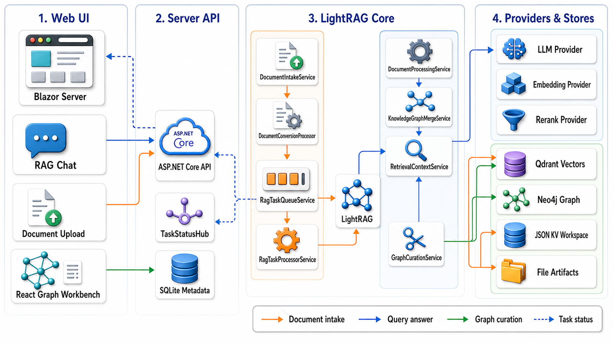
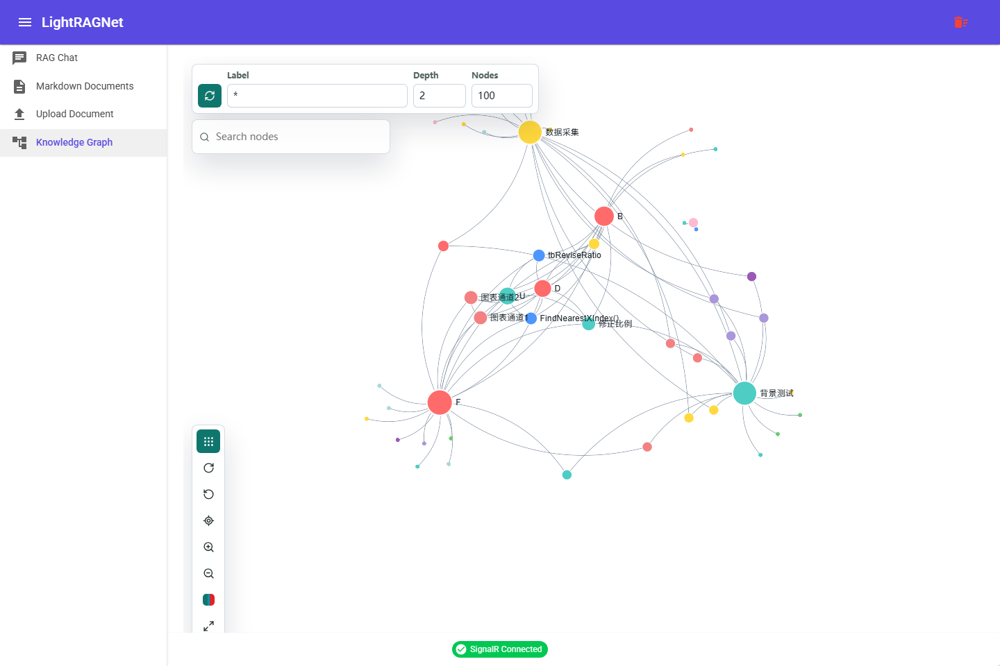

<p align="right">
  <a href="./README.md">中文</a> | <a href="./README.EN.md">English</a>
</p>

<h1 align="center">LightRAGNet</h1>

<p align="center">
  A .NET 10 implementation of LightRAG with document intake, knowledge graphs, vector retrieval, RAG chat, and a graph workbench.
</p>

<p align="center">
  
  
  
  
  
  <a href="./LICENSE"></a>
</p>

<p align="center">
  
</p>

## What Is LightRAGNet?

LightRAGNet is a .NET engineering implementation inspired by Python LightRAG. It brings knowledge-graph retrieval, vector retrieval, document lifecycle management, background task processing, streaming chat, references, diagnostics, and a graph workbench into one runnable solution.

It is useful when you want to:

- Build a LightRAG-style knowledge-base Q&A system in the .NET ecosystem.
- Ingest Markdown, text, PDF, and DOCX documents through a trackable RAG pipeline.
- Combine Qdrant vector search with Neo4j graph search.
- Start from a full-stack project that already includes API, Web UI, SignalR task status, tests, and storage adapters.

## Capabilities

| Area | Status | Notes |
| --- | --- | --- |
| Document intake | Supported | Markdown, text, PDF, DOCX upload; source artifacts and `converted.md` persistence. |
| Background queue | Supported | Status tracking, retry, cancel, deletion, and restart recovery. |
| Retrieval modes | Supported | `Local`, `Global`, `Mix`, `Hybrid`, `Naive`, `Bypass`. |
| KG + vector query | Supported | Neo4j graph retrieval and Qdrant chunk vector retrieval with rerank and references. |
| RAG Chat | Supported | Streaming, cacheable answers, references, diagnostics, and raw retrieval data. |
| Graph workbench | Supported | React/Vite + Sigma workbench hosted by Blazor, with graph viewing, node properties, search, settings, fullscreen, and entity-merge semantics. |
| Test safety | Enforced | Default tests must not mutate local Qdrant / Neo4j development data. |

## Architecture

<p align="center">
  
</p>

Read the diagram through three main paths:

- Document intake: `Document Upload -> ASP.NET Core API -> DocumentIntakeService -> DocumentConversionProcessor -> RagTaskQueueService -> RagTaskProcessorService -> LightRAG -> Qdrant / Neo4j / JSON KV / File Artifacts`.
- Query answer: `RAG Chat -> ASP.NET Core API -> LightRAG -> RetrievalContextService -> LLM Provider`; retrieval context reads both Qdrant chunk vectors and the Neo4j graph.
- Graph curation: `React Graph Workbench -> ASP.NET Core API -> GraphCurationService -> Neo4j / Qdrant`, covering entity edits, merge, deletion, and related index updates.

`TaskStatusHub` pushes background task status back to the Web UI. SQLite stores server-side document metadata, conversion state, and RAG state; vectors and graph data live in Qdrant and Neo4j.

Project layout:

- `src/LightRAGNet.Core`: core interfaces, models, and utilities.
- `src/LightRAGNet.Share`: shared Web / Server DTOs and event contracts.
- `src/LightRAGNet`: main orchestration and core services.
- `src/LightRAGNet.LLM`, `Embedding`, `Rerank`, `Storage`: provider implementations.
- `src/LightRAGNet.Hosting`: dependency injection entry points.
- `src/LightRAGNet.Server`: ASP.NET Core API, SignalR, SQLite metadata, and EF Core migrations.
- `src/LightRAGNet.Web`: Blazor Server UI and the React graph workbench island.
- `tests/`: core, server, and web tests.

## Graph Workbench

<p align="center">
  
</p>

The graph workbench is one of the clearest snapshots of where the project is today. It is not a static mockup: it is the real Knowledge Graph page running inside the Web UI, with the LightRAGNet navigation on the left, a Sigma graph canvas in the middle, subgraph controls for label/depth/node count, and canvas tools for layout, zoom, focus, color semantics, and fullscreen usage.

The goal is not to wrap Neo4j Browser. The goal is to bring the Python LightRAG WebUI graph-curation experience into the .NET project: query with references, inspect the generated graph, then keep improving entity merge, property inspection, and relationship editing from there.

## Quick Start

Prerequisites:

- .NET 10 SDK
- Docker Desktop
- Node.js for the React graph workbench

Restore and build:

```powershell
dotnet restore LightRAGNet.slnx
dotnet build LightRAGNet.slnx
```

Start local storage:

```powershell
docker compose up -d
```

Configure `src/LightRAGNet.Server/appsettings.Development.json` and keep real API keys out of git:

```json
{
  "LLM": {
    "BaseUrl": "https://api.deepseek.com",
    "ApiKey": "your-llm-api-key",
    "ModelName": "deepseek-v4-flash"
  },
  "Embedding": {
    "BaseUrl": "https://dashscope.aliyuncs.com/compatible-mode",
    "ApiKey": "your-embedding-api-key",
    "ModelName": "text-embedding-v4",
    "Dimension": "2048"
  },
  "Rerank": {
    "BaseUrl": "https://dashscope.aliyuncs.com/api/v1/services/rerank/text-rerank/text-rerank",
    "ApiKey": "your-rerank-api-key",
    "ModelName": "qwen3-rerank"
  },
  "Qdrant": {
    "Host": "localhost",
    "Port": "6334",
    "EmbeddingDimension": "2048"
  },
  "Neo4j": {
    "Uri": "neo4j://localhost:7687",
    "User": "neo4j",
    "Password": "your-neo4j-password"
  }
}
```

Run the API server and React frontend:

```powershell
.\scripts\dev-start.ps1
```

Default endpoints:

- API Server: `http://localhost:5261`
- React UI: `http://127.0.0.1:5173/documents`
- Qdrant REST: `http://localhost:6333`
- Neo4j Browser: `http://localhost:7474`

Stop development services:

```powershell
.\scripts\dev-stop.ps1
```

Start only one side:

```powershell
.\scripts\dev-start.ps1 -Target Server
.\scripts\dev-start.ps1 -Target React
```

Git Bash wrappers are also available:

```bash
./scripts/dev-start.sh
./scripts/dev-start.sh -Target React
./scripts/dev-stop.sh
```

You can still start the two services manually:

```powershell
dotnet run --project src/LightRAGNet.Server
npm run dev --prefix src/LightRAGNet.React
```

## C# Example

```csharp
using LightRAGNet;
using LightRAGNet.Core.Models;
using LightRAGNet.Hosting;
using Microsoft.Extensions.Configuration;
using Microsoft.Extensions.DependencyInjection;

var configuration = new ConfigurationBuilder()
    .SetBasePath(AppContext.BaseDirectory)
    .AddJsonFile("appsettings.json", optional: true)
    .Build();

var services = new ServiceCollection();
services.AddLightRAG(configuration);

await using var provider = services.BuildServiceProvider();
var rag = provider.GetRequiredService<LightRAG>();

await rag.InsertAsync(
    "LightRAGNet connects documents, vector retrieval, and knowledge graphs.",
    filePath: "intro.md");

var result = await rag.QueryAsync(
    "What problems is LightRAGNet designed to solve?",
    new QueryParam
    {
        Mode = QueryMode.Mix,
        TopK = 10,
        ChunkTopK = 5,
        EnableRerank = true,
        IncludeReferences = true,
        Stream = false
    });

Console.WriteLine(result.Content);
```

## Development Commands

```powershell
dotnet restore LightRAGNet.slnx
dotnet build LightRAGNet.slnx
dotnet test LightRAGNet.slnx
dotnet run --project src/LightRAGNet.Server
dotnet run --project src/LightRAGNet.Web
```

The React graph workbench can be built separately:

```powershell
Set-Location .\src\LightRAGNet.Web\ClientApp
npm install
npm run build
Set-Location ..\..\..
```

## Test Safety Boundary

`dotnet test LightRAGNet.slnx` must be safe by default and must never delete or mutate local development Qdrant / Neo4j data.

- Server/API tests use in-memory SQLite, temporary working directories, no-op external storage cleaners, and test doubles.
- `LightRagServerFactory` removes real `QdrantClient`, `IDriver`, and hosted background services.
- Real Qdrant / Neo4j integration tests must be explicit opt-in and clean up only resources they own.

## Current Boundaries

- The project is still under active development and is not a hardened public deployment template.
- Default provider configuration targets DeepSeek, DashScope, Qdrant, and Neo4j.
- The graph workbench follows Python LightRAG WebUI semantics and will continue to evolve.
- Docker Compose paths, ports, and default Neo4j credentials should be reviewed before sharing or deployment.

## Relationship With Python LightRAG

LightRAGNet references and ports the architecture, retrieval modes, and graph workbench semantics of Python LightRAG into the .NET ecosystem.

References:

- Python LightRAG: `https://github.com/HKUDS/LightRAG`
- Local reference copy: `LightRAG/`
- System introduction: [LightRAGNet-System-Introduction.md](./LightRAGNet-System-Introduction.md)
- RAG task queue design: [RAG-Task-Queue-Processing-Solution.md](./RAG-Task-Queue-Processing-Solution.md)

## License

[MIT](./LICENSE)
